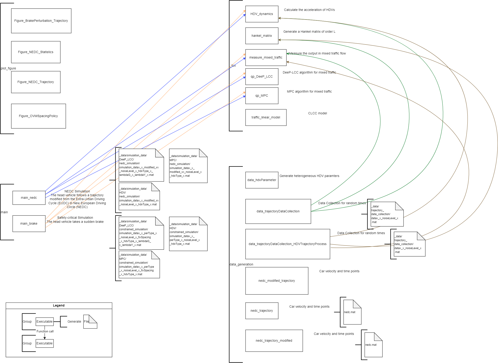
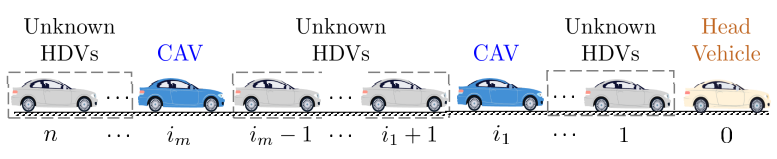
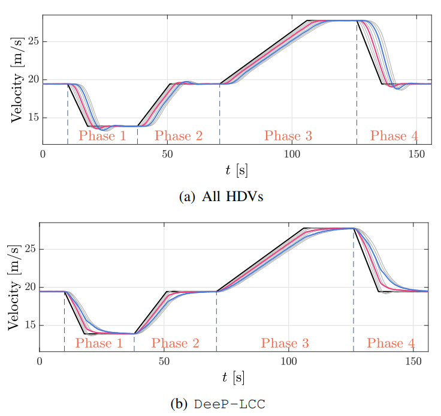
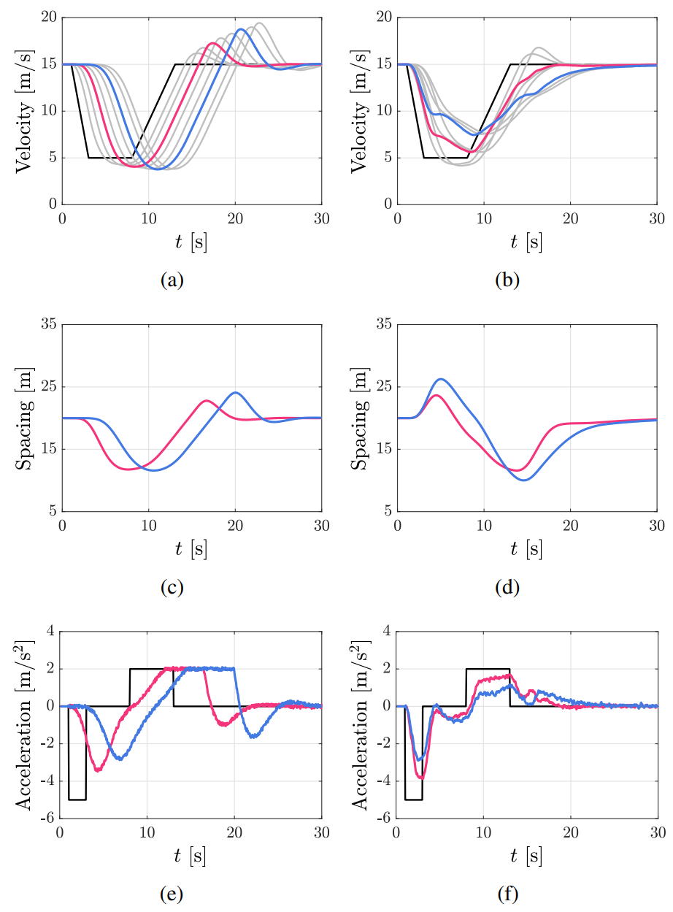

# Data-EnablEd Predictive Leading Cruise Control (DeeP-LCC)

## Introduction
One of the biggest obstacles to the control of connected and autonomous vehicles (CAVs) is the lack of a trivial and accurate way to find car-following dynamics of human-driven vehicles. DeeP-LCC (Data-EnablEd Predictive Leading Cruise Control) introduced in the paper proposed a way to control CAVs in mixed traffic relying on data-driven non-parametric strategies. We used Willems' fundamental lemma in the paper to obtain a data-centric representation of mixed traffic behavior. Then we used a receding horizon strategy to solve the optimization problem at each time step. We further did numeric experiments to validate the performance of DeeP-LCC, which shows good improvements in the traffic and reveals excellent potential for further research. In particular, with a CAV penetration rate of 25%, DeeP-LCC help reduce up to 24.69% fuel consumption with safety guarantees in the emergency braking scenario.
The following content explains how Matlab and Python implementations work for the numeric simulation, and includes a brief discussion of the results.

## Getting Started
Graph of the dependency of all Matlab files:


## Matlab Implementation

#### Main File

##### [main_brake_simulation.m](https://github.com/soc-ucsd/DeeP-LCC/blob/main/main_brake_simulation.m)
This main function is used for safety-critical simulation in the scenario that the head vehicle takes a sudden brake. More detailed can be refered to Section V of the paper "Data-Driven Predicted Control for Connected and Autonomous Vehicles in Mixed Traffic".

Add path and initialization.
```matlab=
clc; close all; clear;
addpath('_fcn');
warning off;
```

Parameter setup. This section includes Scenario Setup and HDV setup.

1. Scenario Setup
```matlab=
% whether traffic flow is mixed
mix                 = 1;                    % 0. all HDVs; 1. there exist CAVs
ID                  = [0,0,1,0,0,1,0,0];    % ID of vehicle types
                                            % 1: CAV  0: HDV
pos_cav             = find(ID==1);          % position of CAVs
n_vehicle           = length(ID);           % number of vehicles
n_cav               = length(pos_cav);      % number of CAVs
n_hdv               = n_vehicle-n_cav;      % number of HDVs

% perturbation on the head vehicle
per_type            = 2;    % 1. sinuoid perturbation 2. brake perturbation 
sine_amp            = 5;    % amplitidue of sinuoid perturbation
brake_amp           = 10;   % brake amplitude of brake perturbation

% time
total_time          = 40;              % Total Simulation Time
Tstep               = 0.05;            % Time Step
total_time_step     = total_time/Tstep;
```

2. HDV setup
```matlab=
% Type for HDV car-following model
hdv_type            = 1;    % 1. OVM   2. IDM
% Parameter setup for HDV 
data_str            = '2';  % 1. random ovm  2. manual heterogeneous ovm  3. homogeneous ovm
switch hdv_type
    case 1
        load(['_data/hdv_ovm_',data_str,'.mat']);
    case 2
        load('_data/hdv_idm.mat');      
end
% Uncertainty for HDV acceleration
acel_noise          = 0.1;  % A white noise signal on HDV's acceleration
```

Formulation for DeeP-LCC

- Parameter setup

```matlab=
% Type of the controller
controller_type     = 2;    % 1. DeeP-LCC  2. MPC 
% Initialize Equilibrium Setup (they might be updated in the control process)
v_star              = 15;   % Equilibrium velocity
s_star              = 20;   % Equilibrium spacing for CAV
% Horizon setup 
Tini                = 20;   % length of past data in control process
N                   = 50;   % length of future data in control process
% Performance cost
weight_v            = 1;    % weight coefficient for velocity error
weight_s            = 0.5;  % weight coefficient for spacing error   
weight_u            = 0.1;  % weight coefficient for control input
% Setup in DeeP-LCC
T                   = 2000; % length of data samples
lambda_g            = 100;  % penalty on ||g||_2^2 in objective
lambda_y            = 1e4;  % penalty on ||sigma_y||_2^2 in objective
% Constraints
constraint_bool     = 1;    % whether there exist constraints
acel_max            = 2;    % maximum acceleration
dcel_max            = -5;   % minimum acceleration (maximum deceleration)
spacing_max         = 40;   % maximum spacing
spacing_min         = 5;    % minimum spacing
u_limit             = [dcel_max,acel_max];
s_limit             = [spacing_min,spacing_max]-s_star;
% what signals are measurable (for output definition)
measure_type        = 3;    % 1. Only the velocity errors of all the vehicles are measurable;
                            % 2. All the states, including velocity error and spacing error are measurable;
                            % 3. Velocity error and spacing error of the CAVs are measurable, 
                            %    and the velocity error of the HDVs are measurable.
% equilibrium setup
fixed_spacing_bool      = 0;    % wheter fix equilibrium spacing
                                % 0. the equilibrium spacing will be updated via an OVM-type spacing policy
                                % 1. fix the equilibrium spacing

```

- Process parameters

```matlab=
n_ctr = 2*n_vehicle;    % number of state variables
m_ctr = n_cav;          % number of input variables
switch measure_type     % number of output variables
    case 1
        p_ctr = n_vehicle;
    case 2
        p_ctr = 2*n_vehicle;
    case 3
        p_ctr = n_vehicle + n_cav;
end

Q_v         = weight_v*eye(n_vehicle);          % penalty for velocity error
Q_s         = weight_s*eye(p_ctr-n_vehicle);    % penalty for spacing error
Q           = blkdiag(Q_v,Q_s);                 % penalty for trajectory error
R           = weight_u*eye(m_ctr);              % penalty for control input

u           = zeros(m_ctr,total_time_step);     % control input
x           = zeros(n_ctr,total_time_step);     % state variables
y           = zeros(p_ctr,total_time_step);     % output variables
pr_status   = zeros(total_time_step,1);         % problem status
e           = zeros(1,total_time_step);         % external input
```

- Pre-collected data

```matlab=
% load pre-collected data for DeeP-LCC
i_data              = 1;    % id of the pre-collected data
load(['_data\trajectory_data_collection\data',data_str,'_',num2str(i_data),'_noiseLevel_',num2str(acel_noise),'.mat']);
```

Simulation
```matlab=
% Mixed traffic states
% S(time,vehicle id,state variable), in state variable: 1. position; 2. velocity; 3. acceleration
S               = zeros(total_time_step,n_vehicle+1,3); 
S(1,1,1)        = 0;
for i = 2 : n_vehicle+1
    S(1,i,1)    = S(1,i-1,1) - hdv_parameter.s_star(i-1);
end
S(1,:,2)        = v_star * ones(n_vehicle+1,1);

%  reference trajectory is all zeros: stabilize the system to equilibrium
r               = zeros(p_ctr,total_time_step+N); 
```

Experiment starts here

- Initialization: the CAVs and the head vehicle have zero control input
```matlab=
% initial past data in control process
uini = zeros(m_ctr,Tini);
eini = zeros(1,Tini);
yini = zeros(p_ctr,Tini);

for k = 1:Tini-1
    % calculate acceleration for the HDVs
    acel                =  HDV_dynamics(S(k,:,:),hdv_parameter) ...
                                -acel_noise + 2*acel_noise*rand(n_vehicle,1);
    
    S(k,1,3)           = 0;               % the head vehicle
    S(k,2:end,3)       = acel;            % all the vehicles use HDV model
    S(k,pos_cav+1,3)   = uini(:,k);       % the CAV
    
    % update traffic states
    S(k+1,:,2)          = S(k,:,2) + Tstep*S(k,:,3);
    S(k+1,1,2)          = eini(k) + v_star;          % the velocity of the head vehicle
    S(k+1,:,1)          = S(k,:,1) + Tstep*S(k,:,2);
    
    % update past output data
    yini(:,k)           = measure_mixed_traffic(S(k,2:end,2),S(k,:,1),ID,v_star,s_star,measure_type);
    
end

k_end = k+1;
yini(:,k_end) = measure_mixed_traffic(S(k_end,2:end,2),S(k_end,:,1),ID,v_star,s_star,measure_type);

% update data in u,e,y
u(:,1:Tini) = uini;
e(:,1:Tini) = eini;
y(:,1:Tini) = yini;

% For MPC, which might have infeasible cases
previous_u_opt = 0; 
```
- Continue the simulation

```matlab=
for k = Tini:total_time_step-1
    % calculate acceleration for the HDVs
    acel         =  HDV_dynamics(S(k,:,:),hdv_parameter) ...
                    -acel_noise + 2*acel_noise*rand(n_vehicle,1);
    S(k,2:end,3) = acel;     % all the vehicles use HDV model

    
    if mix
        switch controller_type
            case 1  % calculate control input via DeeP-LCC     
                if constraint_bool
                    [u_opt,y_opt,pr] = qp_DeeP_LCC(Up,Yp,Uf,Yf,Ep,Ef,uini,yini,eini,Q,R,r(:,k:k+N-1),...
                        lambda_g,lambda_y,u_limit,s_limit);
                else
                    [u_opt,y_opt,pr] = qp_DeeP_LCC(Up,Yp,Uf,Yf,Ep,Ef,uini,yini,eini,Q,R,r(:,k:k+N-1),...
                        lambda_g,lambda_y);
                end
            case 2  % calculate control input via MPC
                if constraint_bool
                    [u_opt,y_opt,pr] = qp_MPC(ID,Tstep,hdv_type,measure_type,v_star,uini,yini,N,Q,R,r(:,k:k+N-1),u_limit,s_limit,previous_u_opt);
                    previous_u_opt   = u_opt;
                else
                    [u_opt,y_opt,pr] = qp_MPC(ID,Tstep,hdv_type,measure_type,v_star,uini,yini,N,Q,R,r(:,k:k+N-1));                    
                end
         end
        % one-step implementation in receding horizon manner
        u(:,k) = u_opt(1:m_ctr,1);
        % update accleration for the CAV
        S(k,pos_cav+1,3)   = u(:,k);
        % judge whether AEB (automatic emergency braking, which is implemented in the function of 'HDV_dynamics') commands to brake
        brake_vehicle_ID = find(acel==dcel_max);                % the vehicles that need to brake
        brake_cav_ID     = intersect(brake_vehicle_ID,pos_cav); % the CAVs that need to brake
        if ~isempty(brake_cav_ID)
            S(k,brake_cav_ID+1,3) = dcel_max;
        end
        % record problem status
        pr_status(k) = pr;
    end
  
    % update traffic states
    S(k+1,:,2) = S(k,:,2) + Tstep*S(k,:,3);
    % perturbation for the head vehicle
    switch per_type
        case 1
            S(k+1,1,2) = v_star + sine_amp*sin(2*pi/(10/Tstep)*(k-Tini));
            S(k+1,:,1) = S(k,:,1) + Tstep*S(k,:,2);
        case 2
            if (k-Tini)*Tstep < brake_amp/5
                S(k+1,1,3) = -5;
            elseif (k-Tini)*Tstep < brake_amp/5+5
                S(k+1,1,3) = 0;
            elseif (k-Tini)*Tstep < brake_amp/5+5+5
                S(k+1,1,3) = 2;
            else
                S(k+1,1,3) = 0;
            end
            S(k+1,:,2) = S(k,:,2) + Tstep*S(k,:,3);
            S(k+1,:,1) = S(k,:,1) + Tstep*S(k,:,2);
    end
    
    % update equilibrium setup for the CAVs
    v_star = mean(S(k-Tini+1:k,1,2));               % update v_star
    if ~fixed_spacing_bool        
        s_star = acos(1-v_star/30*2)/pi*(35-5) + 5; % update s_star
        
    end
    
    % update past data in control process
    uini = u(:,k-Tini+1:k);
    % the output needs to be re-calculated since the equilibrium might have been updated
    for k_past = k-Tini+1:k
    % Record output
        y(:,k_past) = measure_mixed_traffic(S(k_past,2:end,2),S(k_past,:,1),ID,v_star,s_star,measure_type);
        e(k_past)   = S(k_past,1,2) - v_star;
    end 
    yini = y(:,k-Tini+1:k);
    eini = S(k-Tini+1:k,1,2) - v_star;
  
    fprintf('Simulation number: %d  |  process... %2.2f%% \n',i_data,(k-Tini)/total_time_step*100);
    %fprintf('Fixed Spacing: %d',fixed_spacing_bool);
    %fprintf('Current spacing of the first CAV: %4.2f \n',S(k,3,1)-S(k,4,1));
  
end
k_end = k+1;
y(:,k_end) = measure_mixed_traffic(S(k_end,2:end,2),S(k_end,:,1),ID,v_star,s_star,measure_type);

tsim = toc;

fprintf('Simulation ends at %6.4f seconds \n', tsim);
```


- Results output

```matlab=
if mix
switch controller_type
    case 1
        save(['..\_data\simulation_data\DeeP_LCC\constrained_simulation\simulation_data',data_str,'_',num2str(i_data),'_perType_',num2str(per_type),'_noiseLevel_',num2str(acel_noise),...
            '_fixSpacing_',num2str(fixed_spacing_bool),...
            '_hdvType_',num2str(hdv_type),'_lambdaG_',num2str(lambda_g),'_lambdaY_',num2str(lambda_y),'.mat'],...
            'hdv_type','acel_noise','S','T','Tini','N','ID','Tstep','v_star','pr_status');

    case 2
        save(['..\_data\simulation_data\MPC\constrained_simulation\simulation_data',data_str,'_',num2str(i_data),'_perType_',num2str(per_type),'_noiseLevel_',num2str(acel_noise),...
            '_fixSpacing_',num2str(fixed_spacing_bool),...
            '_hdvType_',num2str(hdv_type),'.mat'],...
            'hdv_type','acel_noise','S','T','Tini','N','ID','Tstep','v_star','pr_status');
end
else
    save(['..\_data\simulation_data\HDV\constrained_simulation\simulation_data',data_str,'_',num2str(i_data),'_perType_',num2str(per_type),'_noiseLevel_',num2str(acel_noise),...
            '_hdvType_',num2str(hdv_type),'.mat'],...
            'hdv_type','acel_noise','S','T','Tini','N','ID','Tstep','v_star');
end
```

##### [main_nedc_simulation.m](https://github.com/soc-ucsd/DeeP-LCC/blob/main/main_nedc_simulation.m)
This main function is used for NEDC simulation in the scenario that the head vehicle follows a trajectory modified from the Extra-Urban Driving Cycle (EUDC) in New European Driving Circle (NEDC). More detailed can be refered to Section V of the paper "Data-Driven Predicted Control for Connected and Autonomous Vehicles in Mixed Traffic".

Add path and initialization.
```matlab=
clc; close all; clear;
addpath('_fcn');
warning off;
```

Parameter setup. This section includes Scenario Setup and HDV setup.

1. Scenario Setup

```matlab=
% whether traffic flow is mixed
mix                 = 1;                    % 0. all HDVs; 1. there exist CAVs
ID                  = [0,0,1,0,0,1,0,0];    % ID of vehicle types
                                            % 1: CAV  0: HDV
pos_cav             = find(ID==1);          % position of CAVs
n_vehicle           = length(ID);           % number of vehicles
n_cav               = length(pos_cav);      % number of CAVs
n_hdv               = n_vehicle-n_cav;      % number of HDVs

% Definition for Head vehicle trajectory
head_vehicle_trajectory     = load('./_data/nedc_modified_v1.mat');
end_time                    = head_vehicle_trajectory.time(end);    % end time for the head vehicle trajectory
head_vehicle_trajectory.vel = head_vehicle_trajectory.vel/3.6;

% Initialization Time
initialization_time         = 30;               % Time for the original HDV-all system to stabilize
adaption_time               = 20;               % Time for the CAVs to adjust to their desired state
% Total Simulation Time
total_time                  = initialization_time + adaption_time + end_time;  
Tstep                       = 0.05;             % Time Step
total_time_step             = round(total_time/Tstep);
```

2. HDV setup

```matlab=
% Type for HDV car-following model
hdv_type            = 1;    % 1. OVM   2. IDM
% Parameter setup for HDV 
data_str            = '2';  % 1. random ovm  2. manual heterogeneous ovm  3. homogeneous ovm
switch hdv_type
    case 1
        load(['_data/hdv_ovm_',data_str,'.mat']);
    case 2
        load('_data/hdv_idm.mat');      
end
% Uncertainty for HDV acceleration
acel_noise          = 0.1;  % A white noise signal on HDV's acceleration

```

Formulation for DeeP-LCC

- Parameter setup

```matlab=
% Type of the controller
controller_type     = 1;    % 1. DeeP-LCC  2. MPC 
% Initialize Equilibrium Setup (they might be updated in the control process)
v_star              = 15;   % Equilibrium velocity
s_star              = 20;   % Equilibrium spacing for CAV
% Horizon setup 
Tini                = 20;   % length of past data in control process
N                   = 50;   % length of future data in control process
% Performance cost
weight_v            = 1;    % weight coefficient for velocity error
weight_s            = 0.5;  % weight coefficient for spacing error   
weight_u            = 0.1;  % weight coefficient for control input
% Setup in DeeP-LCC
T                   = 2000; % length of data samples
lambda_g            = 100;  % penalty on ||g||_2^2 in objective
lambda_y            = 1e4;  % penalty on ||sigma_y||_2^2 in objective
% Constraints
constraint_bool     = 1;    % whether there exist constraints
acel_max            = 2;    % maximum acceleration
dcel_max            = -5;   % minimum acceleration (maximum deceleration)
spacing_max         = 40;   % maximum spacing
spacing_min         = 5;    % minimum spacing
u_limit             = [dcel_max,acel_max];
s_limit             = [spacing_min,spacing_max]-s_star;
% what signals are measurable (for output definition)
measure_type        = 3;    % 1. Only the velocity errors of all the vehicles are measurable;
                            % 2. All the states, including velocity error and spacing error are measurable;
                            % 3. Velocity error and spacing error of the CAVs are measurable, 
                            %    and the velocity error of the HDVs are measurable.
```

- Process parameters

```matlab=
n_ctr           = 2*n_vehicle;    % number of state variables
m_ctr           = n_cav;          % number of input variables
switch measure_type               
    case 1
        p_ctr   = n_vehicle;      % number of output variables
    case 2
        p_ctr   = 2*n_vehicle;
    case 3
        p_ctr   = n_vehicle + n_cav;
end

Q_v         = weight_v*eye(n_vehicle);          % penalty for velocity error
Q_s         = weight_s*eye(p_ctr-n_vehicle);    % penalty for spacing error
Q           = blkdiag(Q_v,Q_s);                 % penalty for trajectory error
R           = weight_u*eye(m_ctr);              % penalty for control input

u           = zeros(m_ctr,total_time_step);     % control input
x           = zeros(n_ctr,total_time_step);     % state variables
y           = zeros(p_ctr,total_time_step);     % output variables
pr_status   = zeros(total_time_step,1);         % problem status
e           = zeros(1,total_time_step);         % external input
```

- Pre-collected data

```matlab=
% load pre-collected data for DeeP-LCC
i_data              = 1;    % id of the pre-collected data
load(['_data\trajectory_data_collection\data',data_str,'_',num2str(i_data),'_noiseLevel_',num2str(acel_noise),'.mat']);
```

Simulation
```matlab=
% Mixed traffic states
% S(time,vehicle id,state variable), in state variable: 1. position; 2. velocity; 3. acceleration
S               = zeros(total_time_step,n_vehicle+1,3); 
S(1,1,1)        = 0;
for i = 2 : n_vehicle+1
    S(1,i,1)    = S(1,i-1,1) - hdv_parameter.s_star(i-1);
end
S(1,:,2)        = v_star * ones(n_vehicle+1,1);

%  reference trajectory is all zeros: stabilize the system to equilibrium
r               = zeros(p_ctr,total_time_step+N); 
```

Experiment starts here
- Initialization: all the vehicles use the HDV model
```matlab=
for k = 1:initialization_time/Tstep-1
    % calculate acceleration
    acel            =  HDV_dynamics(S(k,:,:),hdv_parameter) ...
                            -acel_noise + 2*acel_noise*rand(n_vehicle,1);
    S(k,1,3)        = 0;               % the head vehicle
    S(k,2:end,3)    = acel;            % all the vehicles use HDV model
    
    % update traffic states
    S(k+1,:,2)      = S(k,:,2) + Tstep*S(k,:,3);
    S(k+1,1,2)      = head_vehicle_trajectory.vel(1);    % the velocity of the head vehicle
    S(k+1,:,1)      = S(k,:,1) + Tstep*S(k,:,2);
    
    % update equilibrium velocity
    v_star          = head_vehicle_trajectory.vel(1);
    % update states in DeeP-LCC
    y(:,k)          = measure_mixed_traffic(S(k,2:end,2),S(k,:,1),ID,v_star,s_star,measure_type);
    e(k)            = S(k,1,2) - v_star;
    u(:,k)          = S(k,pos_cav+1,3);
        
end

% update past data in control process
uini                = u(:,k-Tini+1:k);
yini                = y(:,k-Tini+1:k);
eini                = S(k-Tini+1:k,1,2) - v_star;
```

- The CAVs start to use DeeP-LCC

```matlab=
for k = initialization_time/Tstep:total_time_step-1
    % calculate acceleration for the HDVs
    acel            =  HDV_dynamics(S(k,:,:),hdv_parameter) ...
                    -acel_noise + 2*acel_noise*rand(n_vehicle,1);
    S(k,2:end,3)    = acel;     
    
    if mix
        switch controller_type
            case 1  % calculate control input via DeeP-LCC     
                if constraint_bool
                    [u_opt,y_opt,pr] = qp_DeeP_LCC(Up,Yp,Uf,Yf,Ep,Ef,uini,yini,eini,Q,R,r(:,k:k+N-1),...
                        lambda_g,lambda_y,u_limit,s_limit);
                else
                    [u_opt,y_opt,pr] = qp_DeeP_LCC(Up,Yp,Uf,Yf,Ep,Ef,uini,yini,eini,Q,R,r(:,k:k+N-1),...
                        lambda_g,lambda_y);
                end
            case 2  % calculate control input via MPC
                if constraint_bool
                    [u_opt,y_opt,pr] = qp_MPC(ID,Tstep,hdv_type,measure_type,v_star,uini,yini,N,Q,R,r(:,k:k+N-1),u_limit,s_limit);
                else
                    [u_opt,y_opt,pr] = qp_MPC(ID,Tstep,hdv_type,measure_type,v_star,uini,yini,N,Q,R,r(:,k:k+N-1));
                end
        end
        % one-step implementation in receding horizon manner
        u(:,k)                      = u_opt(1:m_ctr,1);
        % update accleration for the CAV
        S(k,pos_cav+1,3)            = u(:,k);
        % judge whether AEB (automatic emergency braking, which is implemented in the function of 'HDV_dynamics') commands to brake
        brake_vehicle_ID            = find(acel==dcel_max);                % the vehicles that need to brake
        brake_cav_ID                = intersect(brake_vehicle_ID,pos_cav); % the CAVs that need to brake
        if ~isempty(brake_cav_ID)
            S(k,brake_cav_ID+1,3)   = dcel_max;
        end
        % record problem status
        pr_status(k)                = pr;
    end
  
    % update traffic states
    S(k+1,:,2)      = S(k,:,2) + Tstep*S(k,:,3);
    % trajectory for the head vehicle
    % before adaption_time, the head vehicle maintains its velocity and the CAVs first stabilize the traffic system
    if k*Tstep < initialization_time + adaption_time 
        S(k+1,1,2)  = head_vehicle_trajectory.vel(1);
    else
        S(k+1,1,2)  = head_vehicle_trajectory.vel(k-(initialization_time+adaption_time)/Tstep+1);
    end
    S(k+1,:,1)      = S(k,:,1) + Tstep*S(k,:,2);
    
    % update equilibrium setup for the CAVs
    v_star          = mean(S(k-Tini+1:k,1,2));              % average velocity of the head vehicle among the past Tini time
    s_star          = acos(1-v_star/30*2)/pi*(35-5) + 5;    % use the OVM-type spacing policy to calculate the equilibrium spacing of the CAVs
    
    % update past data in control process
    uini = u(:,k-Tini+1:k);
    % the output needs to be re-calculated since the equilibrium has been updated
    for k_past = k-Tini+1:k
        y(:,k_past) = measure_mixed_traffic(S(k_past,2:end,2),S(k_past,:,1),ID,v_star,s_star,measure_type);
        e(k_past)   = S(k_past,1,2) - v_star;
    end 
    yini = y(:,k-Tini+1:k);
    eini = S(k-Tini+1:k,1,2) - v_star;
    
    fprintf('Current simulation time: %.2f seconds (%.2f%%) \n',k*Tstep,(k*Tstep-initialization_time)/(total_time-initialization_time)*100);
  
end
k_end = k+1;
y(:,k_end) = measure_mixed_traffic(S(k_end,2:end,2),S(k_end,:,1),ID,v_star,s_star,measure_type);

tsim = toc;

fprintf('Simulation ends at %6.4f seconds \n', tsim);
```

Results output
```matlab=
if mix
switch controller_type
    case 1    
        save(['..\_data\simulation_data\DeeP_LCC\nedc_simulation\simulation_data',data_str,'_',num2str(i_data),'_modified_v',num2str(trajectory_id),'_noiseLevel_',num2str(acel_noise),...
            '_hdvType_',num2str(hdv_type),'_lambdaG_',num2str(lambda_g),'_lambdaY_',num2str(lambda_y),'.mat'],...
            'hdv_type','acel_noise','S','T','Tini','N','ID','Tstep','v_star');
    case 2
        save(['..\_data\simulation_data\MPC\nedc_simulation\simulation_data',data_str,'_',num2str(i_data),'_modified_v',num2str(trajectory_id),'_noiseLevel_',num2str(acel_noise),...
            '_hdvType_',num2str(hdv_type),'.mat'],...
            'hdv_type','acel_noise','S','T','Tini','N','ID','Tstep','v_star');
end
else
    save(['..\_data\simulation_data\HDV\nedc_simulation\simulation_data',data_str,'_',num2str(i_data),'_modified_v',num2str(trajectory_id),'_noiseLevel_',num2str(acel_noise),...
            '_hdvType_',num2str(hdv_type),'.mat'],...
            'hdv_type','acel_noise','S','T','Tini','N','ID','Tstep','v_star');

end

```

#### Functions

##### [HDV_dynamics.m](https://github.com/soc-ucsd/DeeP-LCC/blob/main/_fcn/HDV_dynamics.m)
This function takes S and parameter as input to  calculate the acceleration of HDVs.
- S:            state of all the vehicles
- type:         type of the HDV car-following model
- parameter:    Parameter value in the car-following model
- acel:         acceleration of HDVs

```matlab=
function [acel] = HDV_dynamics(S,parameter)

num_vehicle = size(S,2)-1;

acel_max    = 2;
dcel_max    = -5;

switch parameter.type
    case 1                    
        V_diff = S(1,1:(end-1),2) - S(1,2:end,2);
        D_diff = S(1,1:(end-1),1) - S(1,2:end,1);
        cal_D = D_diff'; % For the boundary of Optimal Veloicity Calculation
        for i = 1:num_vehicle
            if cal_D(i) > parameter.s_go(i)
                cal_D(i) = parameter.s_go(i);
            elseif cal_D(i) < parameter.s_st
                cal_D(i) = parameter.s_st;
            end
        end        
        
        % nonlinear OVM Model
        % V_d = v_max/2*(1-cos(pi*(s-s_st)/(s_go-s_st)));
        % a   = alpha*(V_d-v2)+beta*(v1-v2);
        acel  = parameter.alpha.*(parameter.v_max/2.*(1-cos(pi*(cal_D-parameter.s_st)./(parameter.s_go-parameter.s_st))) ...
                - S(1,2:end,2)') + parameter.beta.*V_diff';       
        
        % % acceleration saturation
        acel(acel>acel_max) = acel_max;
        acel(acel<dcel_max) = dcel_max;
        %
        % SD as ADAS to prevent crash
        acel_sd = (S(1,2:end,2).^2-S(1,1:(end-1),2).^2)./2./D_diff;
        acel(acel_sd>abs(dcel_max)) = dcel_max;
    case 2
        % Driver Model: IDM
        v_max       = 30;
        T_gap       = 1;
        a           = 1;
        b           = 1.5;
        delta       = 4;
        s_st        = 5;
        
        V_diff  = S(1,1:(end-1),2) - S(1,2:end,2);
        D_diff  = S(1,1:(end-1),1) - S(1,2:end,1);
        
        acel    = a.*(1- (S(1,2:end,2)/v_max).^delta -...
                    ((s_st+T_gap.*S(1,2:end,2)-V_diff.*S(1,2:end,2)/2./sqrt(a)./sqrt(b))./D_diff).^2);
        acel    = acel'; 
        % % acceleration saturation
        % acel(acel>acel_max) = acel_max;
        % acel(acel<dcel_max) = dcel_max;
        %
        % SD as ADAS to prevent crash
        acel_sd = (S(1,2:end,2).^2-S(1,1:(end-1),2).^2)./2./D_diff;
        acel(acel_sd>abs(dcel_max)) = dcel_max;
end

end
```

##### [hankel_matrix.m](https://github.com/soc-ucsd/DeeP-LCC/blob/main/_fcn/hankel_matrix.m)
This function is used for generating a Hankel matrix of order L.
```matlab=
function [U] = hankel_matrix(u,L)

m = size(u,1);
T = size(u,2);

U = zeros(m*L,T-L+1);

for i = 1:L
   U((1+(i-1)*m):i*m,:) = u(:,i:(i+T-L));
end

end
```

##### [measure_mixed_traffic.m](https://github.com/soc-ucsd/DeeP-LCC/blob/main/_fcn/measure_mixed_traffic.m)
This function take the a series of parameters setting as input to measure the output in mixed traffic flow.
- vel:      velocity of each vehicle
- pos:      position of each vehicle    
- ID:       ID of vehicle types (1 for CAV, 0 for HDV)
- v_star:   equilibrium velocity
- s_star:   equilibrium spacing
- type:
  1. Only the velocity errors of all the vehicles are measurable;
  2. All the states, including velocity error and spacing error are measurable;
  3. Velocity error and spacing error of the CAVs are measurable,and the velocity error of the HDVs are measurable.
```matlab=
function [y] = measure_mixed_traffic(vel,pos,ID,v_star,s_star,type)

pos_cav     = find(ID==1);          % position of CAVs

switch type
    case 1
        y = (vel - v_star)';
    case 2
        spacing = pos(1:end-1) - pos(2:end);
        y = [(vel - v_star)';
             (spacing - s_star)'];
    case 3
        spacing = pos(1:end-1) - pos(2:end);
        y = [(vel - v_star)';
             (spacing(pos_cav) - s_star)'];
end

end
```

##### [qp_DeeP_LCC.m](https://github.com/soc-ucsd/DeeP-LCC/blob/main/_fcn/qp_DeeP_LCC.m)

Input:
- Up & Uf:             Hankel matrix of pre-collected input data
- Yp & Yf:             Hankel matrix of pre-collected output data
- Ep & Ef:             Hankel matrix of pre-collected external input data
- uini & yini & eini:  past data of length Tini in control process
- Q & R:               weight coefficient matrix in performance cost
- r:                   reference trajectory
- lambda_g & lambda_y: coefficient in regulation for nonlinearty and uncertainty
- u_limit & s_limit:   bound on control input & spacing

Output:
- u_opt:               designed optimal future control input
- y_opt:               predicted output in the optimal future control input
- problem_status:      problem status in optimization calculation

Optimization formulation:

minimize $$ ||y||_{Q_blk}^2 + ||u||_{R_blk}^2 + lambda_g||g||_2^2 + lambda_y||sigma_y||_2^2 $$

subject to:
$$\begin{bmatrix}
{Up}\\
{Ep}\\
{Up}\\
{Uf}\\
{Ef}\\
{Yf}\\
\end{bmatrix} g = \begin{bmatrix}
{uini}\\
{eini}\\
{yini}\\
{u}\\
{e}\\
{y}\\
\end{bmatrix} + \begin{bmatrix}
{0}\\
{0}\\
{sigma_y}\\
{0}\\
{0}\\
{0}\\
\end{bmatrix}$$
where e = 0, u in u_limit, [0 I_m]y in s_limit 

We transform the problem into **standard quadratic programming** for calculation.
<details>
<summary>Click here to view code</summary>

```matlab=
function [u_opt,y_opt,problem_status] = qp_DeeP_LCC(Up,Yp,Uf,Yf,Ep,Ef,...
    uini,yini,eini,Q,R,r,lambda_g,lambda_y,u_limit,s_limit)

% whether there exists input/output constraints
if nargin < 15          
    constraint_bool = 0;
else
    constraint_bool = 1;
end

% ------------
% parameters
% ------------
m        = size(uini,1);                % dimension of control input
p        = size(yini,1);                % dimension of output
Tini     = size(Up,1)/m;                % horizon of past data
N        = size(Uf,1)/m;                % horizon of future data
T        = size(Up,2) + Tini + N - 1;   % time length of pre-collected data

% reshape past data into one single trajectory
% uini = col(u(-Tini),u(-Tini+1),...,u(-1)) (similarly for yini and eini)
uini_col = reshape(uini,[m*Tini,1]);
yini_col = reshape(yini,[p*Tini,1]);
eini_col = reshape(eini,[Tini,1]);
r_col    = reshape(r,[p*N,1]);

Q_blk    = zeros(p*N);
R_blk    = zeros(m*N); 
for i = 1:N
    Q_blk((i-1)*p+1:i*p,(i-1)*p+1:i*p) = Q; 
    R_blk((i-1)*m+1:i*m,(i-1)*m+1:i*m) = R; 
end


% ---------------------
% Standard QP in MATLAB
% [x,fval,exitflag,output,lambda]=quadprog(H,f,A,b,B,c,l,u,x0,options)
% minimize     0.5*x'*H*x+f'*x    
% subject to         A*x          <= b 
%                    B*x           = c
%                    l <= x <= u 
% ---------------------

% Coefficient
H       = Yf'*Q_blk*Yf + Uf'*R_blk*Uf + lambda_g*eye(T-Tini-N+1) + lambda_y*Yp'*Yp;
f       = -lambda_y*Yp'*yini_col;

B       = [Up;Ep;Ef];
c       = [uini_col;eini_col;zeros(N,1)];

if constraint_bool % there exists input/output constraints
    Sf = [zeros(m,p-m),eye(m)];
    Sf_blk = Sf;
    for i = 2:N
        Sf_blk = blkdiag(Sf_blk,Sf); 
    end
    A = [Uf;-Uf;Sf_blk*Yf;-Sf_blk*Yf];
    b = [max(u_limit)*ones(m*N,1);-min(u_limit)*ones(m*N,1);...
        max(s_limit)*ones(m*N,1);-min(s_limit)*ones(m*N,1)];
else
    A = [];
    b = [];
end
options = optimoptions('quadprog');
options = optimoptions(options,'MaxIterations',1e4);
% options = optimoptions('quadprog','MaxIterations',1e4);
% Optimization
[g_opt,fval,exitflag,output,lambda] = quadprog(H,f,A,b,B,c,[],[],[],options);

% Solution
u_opt   = Uf*g_opt;
y_opt   = Yf*g_opt;
problem_status = exitflag;

% % For infeasible cases
% if exitflag ~= 1
%     u_opt = previous_u_opt;
% end

end
```
</details>

##### [qp_MPC.m](https://github.com/soc-ucsd/DeeP-LCC/blob/main/_fcn/qp_MPC.m)

Input:
- ID:                 vehicle ID
- Ts:                 sampling time
- hdv_type:           type of HDV car-following model
- measure_type:       measure type for output definition
- v_star:             equilibrium velocity
- uini & yini:        past data of length Tini in control process
- N:                  future time length (predicted horizon)
- Q & R:              weight coefficient matrix in performance cost
- r:                  reference trajectory
- u_limit & s_limit:  bound on control input & spacing
- previous_u_opt:     control input in previous time step

Output:
- u_opt:               designed optimal future control input
- y_opt:               predicted output in the optimal future control input
- problem_status:      problem status in optimization calculation

Optimization Formulation:

mininize $$||y||_{Q_blk}^2 + ||u||_{R_blk}^2 $$

subject to:
- xini is estimated from past data uini,yini 
- x    = Ax + Bu
- y    = Cx

We transform the problem into **standard quadratic programming** for calculation
<details>
<summary>Click here to view code</summary>

```matlab=
function [u_opt,y_opt,problem_status] = qp_MPC(ID,Ts,hdv_type,measure_type,...
    v_star,uini,yini,N,Q,R,r,u_limit,s_limit,previous_u_opt)

% -------------------------------------------------------------------------
%  Calculate via Linear model
% -------------------------------------------------------------------------
if nargin < 12          % whether there exists input/output constraints
    constraint_bool = 0;
else
    constraint_bool = 1;
end

%  linear model
[A,B,C]     = traffic_linear_model(ID,Ts,hdv_type,measure_type,v_star);
%  dimension
m           = size(uini,1);     % dimension of control input
p           = size(yini,1);     % dimension of output
n           = size(A,1);        % dimension of state
Tini        = size(uini,2);     % horizon of past data


% reshape past data into one single trajectory
% uini = col(u(-Tini),u(-Tini+1),...,u(-1)) (similarly for yini and eini)
uini_col    = reshape(uini,[m*Tini,1]);
yini_col    = reshape(yini,[p*Tini,1]);

Obsv_Tini = zeros(p*Tini,n);
for i = 1:Tini
    Obsv_Tini((i-1)*p+1:i*p,:) = C*A^(i-1);
end

Toep_Tini = zeros(p*Tini,m*Tini);
Toep_Tini(1*p+1:2*p,0*m+1:1*m) = C*B;
for i = 3:Tini
    for j = 1:i-1
        Toep_Tini((i-1)*p+1:i*p,(j-1)*m+1:j*m) = C*A^(i-1-j)*B;
    end
end

Obsv_N = zeros(p*N,n);
for i = 1:N
    Obsv_N((i-1)*p+1:i*p,:) = C*A^(i-1);
end

Toep_N = zeros(p*N,m*N);
Toep_N(1*p+1:2*p,0*m+1:1*m) = C*B;
for i = 3:N
    for j = 1:i-1
        Toep_N((i-1)*p+1:i*p,(j-1)*m+1:j*m) = C*A^(i-1-j)*B;
    end
end

Ctrb_Tini = zeros(n,m*Tini);
for i = 1:Tini
   Ctrb_Tini(:,(i-1)*m+1:i*m) = A^(Tini-i)*B; 
end

x_1             = pinv(Obsv_Tini)*(yini_col-Toep_Tini*uini_col);
x_Tini_plus1    = A^Tini*x_1 + Ctrb_Tini*uini_col;

r_col    = reshape(r,[p*N,1]);


Q_blk    = zeros(p*N);
R_blk    = zeros(m*N); 
for i = 1:N
    Q_blk((i-1)*p+1:i*p,(i-1)*p+1:i*p) = Q; 
    R_blk((i-1)*m+1:i*m,(i-1)*m+1:i*m) = R; 
end

Cu       = Obsv_N*(Ctrb_Tini-A^Tini*pinv(Obsv_Tini)*Toep_Tini)*uini_col + Obsv_N*A^Tini*pinv(Obsv_Tini)*yini_col;
% ---------------------
% Standard QP in MATLAB
% [x,fval,exitflag,output,lambda]=quadprog(H,f,A,b,B,c,l,u,x0,options)
% minimize     0.5*x'*H*x+f'*x    
% subject to         A*x          <= b 
%                    B*x           = c
%                    l <= x <= u 
% ---------------------


% Coefficient
H       = Toep_N'*Q_blk*Toep_N+R_blk;
f       = Toep_N'*Q_blk*Obsv_N*x_Tini_plus1;

if constraint_bool % there exists input/output constraints
    Sf = [zeros(m,p-m),eye(m)];
    Sf_blk = Sf;
    for i = 2:N
        Sf_blk = blkdiag(Sf_blk,Sf); 
    end
    A = [eye(m*N);-eye(m*N);...
        Sf_blk*Toep_N;-Sf_blk*Toep_N];
    b = [max(u_limit)*ones(m*N,1);-min(u_limit)*ones(m*N,1);...
        max(s_limit)*ones(m*N,1)-Sf_blk*Cu;-min(s_limit)*ones(m*N,1)+Sf_blk*Cu];
else
    A = [];
    b = [];
end

% Optimization
[u_opt,fval,exitflag,output,lambda] = quadprog(H,f,A,b,[],[]);

% For infeasible cases
if exitflag ~= 1
    u_opt = previous_u_opt;
end

% Solution
y_opt       = Obsv_N*x_Tini_plus1+Toep_N*u_opt;
problem_status = exitflag;


end
```
</details>

##### [traffic_linear_model.m](https://github.com/soc-ucsd/DeeP-LCC/blob/main/_fcn/traffic_linear_model.m)

This function is used for CLCC model.

- ID: vehicle ID
- Ts: sampling time
- hdv_type:     type of HDV car-following model
- measure_type: measure type
<details>
<summary>Click here to view code</summary>

```matlab=
function [pos_cav, n_vehicle, n_cav, A, Ad,Bd,Cd] = traffic_linear_model(ID,Ts,hdv_type,measure_type,v_star)

switch hdv_type
    case 1
        % Driver Model: OVM
        alpha   = 0.6; 
        beta    = 0.9;
        s_st    = 5;
        s_go    = 35;
        v_max   = 30;
        % Equilibrium spacing
        s_star  = acos(1-v_star/v_max*2)/pi*(s_go-s_st)+s_st; 
        % Linear coefficients
        alpha1 = alpha*v_max/2*pi/(s_go-s_st)*sin(pi*(s_star-s_st)/(s_go-s_st));
        alpha2 = alpha+beta;
        alpha3 = beta;
    case 2
        % Driver Model: IDM
        v_max   = 30;
        T_gap   = 1;
        a       = 1;
        b       = 1.5;
        delta   = 4;
        s_st    = 5;
        % Equilibrium spacing
        s_star  = (s_st+T_gap*v_star)/sqrt(1-(v_star/v_max)^delta);
        % Linear coefficients
        alpha1  = 2*a*(s_st+T_gap*v_star)^2/s_star^3;
        alpha2  = sqrt(a/b)*v_star*(s_st+T_gap*v_star)/s_star^2+2*a*(2*v_star^3/v_max^4+T_gap*(s_st+T_gap*v_star)/s_star^2);
        alpha3  = sqrt(a/b)*v_star*(s_st+T_gap*v_star)/s_star^2;
end

pos_cav     = find(ID==1);          % position of CAVs
n_vehicle   = length(ID);           % number of vehicles
n_cav       = length(pos_cav);      % number of CAVs

A = zeros(n_vehicle*2);

P1 = [0,-1;alpha1,-alpha2];
P2 = [0,1;0,alpha3];
S1 = [0,-1;0,0];
S2 = [0,1;0,0];

A(1:2,1:2) = P1;
for i = 2:n_vehicle
    if ID(i) == 0
        A(2*i-1:2*i,2*i-1:2*i)     = P1;
        A(2*i-1:2*i,2*i-3:2*i-2)   = P2;
    else
        A(2*i-1:2*i,2*i-1:2*i)     = S1;
        A(2*i-1:2*i,2*i-3:2*i-2)   = S2;
    end
end

B = zeros(2*n_vehicle,n_cav);
for i = 1:n_cav
   B(pos_cav(i)*2,i) = 1; 
end

switch measure_type
    case 1
        C = zeros(n_vehicle,2*n_vehicle);
        for i = 1:n_vehicle
            C(i,2*i) = 1;
        end
    case 2
        C = zeros(2*n_vehicle);
        for i = 1:n_vehicle
            C(i,2*i) = 1;
            C(n_vehicle+i,2*i-1) = 1;
        end
    case 3
        C = zeros(n_vehicle+n_cav,2*n_vehicle);
        for i = 1:n_vehicle
            C(i,2*i) = 1;
        end
        for i = 1:n_cav
            C(n_vehicle+i,2*pos_cav(i)-1) = 1;
        end
end


Ad      = Ts*A + eye(2*n_vehicle);
Bd      = B*Ts;
Cd      = C; 

end
```
</details>

#### Data Generation
##### [data_hdvParameter.m](https://github.com/soc-ucsd/DeeP-LCC/blob/main/data_generation/data_hdvParameter.m)

This function is used for generating heterogeneous HDV paramters.
<details>
<summary>Click here to view code</summary>

```matlab=
hdv_type = 1;
v_star   = 15;

% -------------------
% ID          = [0,0,1,0,0,1,0,0];    % ID of vehicle types
                                    % 1: CAV  0: HDV
% -------------------

% Homegeneous setup for OVM
alpha       = 0.6*ones(8,1);
beta        = 0.9*ones(8,1);
s_go        = 25*ones(8,1);
s_st        = 5;
v_max       = 30;
% Equilibrium spacing
s_star  = acos(1-v_star/v_max*2)./pi*(s_go-s_st) + s_st;

hdv_parameter = struct('type',hdv_type,...
            'alpha',alpha,'beta',beta,'s_st',s_st,'s_go',s_go,'v_max',v_max,'s_star',s_star);
save('_data/hdv_ovm_homogeneous.mat','hdv_parameter');

switch hdv_type
    case 1
        % Driver Model: OVM
        alpha       = 0.4 + 0.4*rand(8,1);
        beta        = 0.7 + 0.4*rand(8,1);
        s_go        = 30 + 10*rand(8,1);
        s_st        = 5;
        v_max       = 30;
        
        % Manual set for parameters        
        alpha   = [0.45;0.75;0.60;0.70;0.50;0.60;0.40;0.80];
        beta    = [0.60;0.95;0.90;0.95;0.75;0.90;0.80;1.00];
        s_go    = [ 38 ; 31 ; 35 ; 33 ; 37 ; 35 ; 39 ; 34 ];
        
        % Consider nominal parameter for the CAV position, which only works
        % in comparison for all the vehicles are HDVs
        alpha(3)    = 0.6;
        alpha(6)    = 0.6;
        beta(3)     = 0.9;
        beta(6)     = 0.9;
        s_go(3)     = 35;
        s_go(6)     = 35;
        
        % Equilibrium spacing
        s_star  = acos(1-v_star/v_max*2)./pi*(s_go-s_st) + s_st;
        
    case 2
        % Driver Model: IDM
        v_max       = 30;
        T_gap       = ones(8,1);
        a           = 1;
        b           = 1.5;
        delta       = 4;
        s_st        = 5;
        
        % Equilibrium spacing
        s_star  = (s_st+T_gap.*v_star)./sqrt(1-(v_star/v_max)^delta);
end

switch hdv_type
    case 1
        hdv_parameter = struct('type',hdv_type,...
            'alpha',alpha,'beta',beta,'s_st',s_st,'s_go',s_go,'v_max',v_max,'s_star',s_star);
        save('_data/hdv_ovm.mat','hdv_parameter');
    case 2
        hdv_parameter = struct('type',hdv_type,...
            'v_max',v_max,'T_gap',T_gap,'a',a,'b',b,'delta',delta,'s_st',s_st,'s_star',s_star);
        save('_data/hdv_idm.mat','hdv_parameter');
end
```
</details>

##### [data_trajectoryDataCollection.m](https://github.com/soc-ucsd/DeeP-LCC/blob/main/data_generation/data_trajectoryDataCollection.m)

This function is used for data collection for random times.
<details>
<summary>Click here to view code</summary>

```matlab=
data_total_number = 100;

h_wait = waitbar(0,'please wait');

for i_data = 1:data_total_number

% -------------------------------------------------------------------------
%   Parameter setup
% -------------------------------------------------------------------------

% Type for HDV car-following model
hdv_type        = 1;    % 1. OVM   2. IDM
% Uncertainty for HDV behavior
acel_noise      = 0.1;  % A white noise signal on HDV's original acceleration
% Data set
data_str        = '3';  % 1. random ovm  2. manual ovm  3. homogeneous ovm

% Parameters in Simulation
total_time       = 40;              % Total Simulation Time
Tstep            = 0.05;            % Time Step
total_time_step  = total_time/Tstep;

% DeePC Formulation
T       = 2000;      % length of data samples
Tini    = 20;        % length of past data
N       = 50;        % length of predicted horizon

weight_v     = 1;        % weight coefficient for velocity error
weight_s     = 0.5;      % weight coefficient for spacing error   
weight_u     = 0.1;      % weight coefficient for control input

lambda_g     = 1;        % penalty on ||g||_2^2 in objective
lambda_y     = 1e3;      % penalty on ||sigma_y||_2^2 in objective

% System Dynamics
% vel_noise = 0.1;         % noise signal in velocity signal

% ------------------------------------------
% Parameters in Mixed Traffic
% ------------------------------------------
ID          = [0,0,1,0,0,1,0,0];    % ID of vehicle types
                                    % 1: CAV  0: HDV
pos_cav     = find(ID==1);          % position of CAVs
n_vehicle   = length(ID);           % number of vehicles
n_cav       = length(pos_cav);      % number of CAVs
n_hdv       = n_vehicle-n_cav;      % number of HDVs

mix         = 1;                    % whether mixed traffic flow

v_star      = 15;                   % Equilibrium velocity
s_star      = 20;                   % Equilibrium spacing for CAV

switch hdv_type
    case 1
        % Driver Model: OVM
        load(['_data/hdv_ovm_',num2str(data_str),'.mat']);
    case 2
        % Driver Model: IDM
        load('_data/hdv_idm.mat');
%         v_max   = 30;
%         T_gap   = 1;
%         a       = 1;
%         b       = 1.5;
%         delta   = 4;
%         s_st    = 5;
%         % Equilibrium spacing
%         s_star  = (s_st+T_gap*v_star)/sqrt(1-(v_star/v_max)^delta);        
end

acel_max = 2;
dcel_max = -5;
    
% What is measurable
% for measure_type    = 2:3
measure_type = 3;
% 1. Only the velocity errors of all the vehicles are measurable;
% 2. All the states, including velocity error and spacing error are measurable;
% 3. Velocity error and spacing error of the CAVs are measurable, 
%    and the velocity error of the HDVs are measurable.

% ------------------
%  size in DeePC
% ------------------

n_ctr = 2*n_vehicle;    % number of state variables
m_ctr = n_cav;          % number of input variables
switch measure_type     % number of output variables
    case 1
        p_ctr = n_vehicle;
    case 2
        p_ctr = 2*n_vehicle;
    case 3
        p_ctr = n_vehicle + n_cav;
end

% -------------------------------------------------------------------------
%   Scenario initialization
%-------------------------------------------------------------------------- 

% There is one head vehicle at the very beginning
S           = zeros(total_time_step,n_vehicle+1,3);
S(1,1,1)    = 0;
for i = 2 : n_vehicle+1
    S(1,i,1) = S(1,i-1,1) - hdv_parameter.s_star(i-1);
end
S(1,:,2)    = v_star * ones(n_vehicle+1,1);

% -------------------------------------------------------------------------
%   Data collection
%-------------------------------------------------------------------------- 

% ------------------
%  persistently exciting input data
% ------------------
ud          = -1+2*rand(m_ctr,T);
ed          = -1+2*rand(1,T);
yd          = zeros(p_ctr,T);

% ------------------
%  generate output data
% ------------------
for k = 1:T-1
    % Update acceleration
    acel               = HDV_dynamics(S(k,:,:),hdv_parameter) ...
                         -acel_noise + 2*acel_noise*rand(n_vehicle,1);
    
    S(k,1,3)           = 0;         % the head vehicle
    S(k,2:end,3)       = acel;      % all the vehicles using HDV model
    S(k,pos_cav+1,3)   = ud(:,k);   % the CAVs
    
    S(k+1,:,2) = S(k,:,2) + Tstep*S(k,:,3);
    S(k+1,1,2) = ed(k) + v_star;   % the velocity of the head vehicle
    S(k+1,:,1) = S(k,:,1) + Tstep*S(k,:,2);    
    
    yd(:,k) = measure_mixed_traffic(S(k,2:end,2),S(k,:,1),ID,v_star,s_star,measure_type);
end
k = k+1;
yd(:,k) = measure_mixed_traffic(S(k,2:end,2),S(k,:,1),ID,v_star,s_star,measure_type);

% ------------------
%  organize past data and future data
% ------------------
U   = hankel_matrix(ud,Tini+N);
Up  = U(1:Tini*m_ctr,:);
Uf  = U((Tini*m_ctr+1):end,:);

E   = hankel_matrix(ed,Tini+N);
Ep  = E(1:Tini,:);
Ef  = E((Tini+1):end,:);

Y   = hankel_matrix(yd,Tini+N);
Yp  = Y(1:Tini*p_ctr,:);
Yf  = Y((Tini*p_ctr+1):end,:);

str=['Processing...',num2str(i_data/data_total_number*100),'%'];
    waitbar(i_data/data_total_number,h_wait,str);

save(['_data\trajectory_data_collection\data',num2str(data_str),'_',num2str(i_data),'_noiseLevel_',num2str(acel_noise),'.mat'],...
    'hdv_type','acel_noise','Up','Yp','Uf','Yf','Ep','Ef','T','Tini','N','ID','Tstep','v_star');

end

close(h_wait);
```
</details>

##### [data_trajectoryDataCollection_HDVTrajectoryProcess.m](https://github.com/soc-ucsd/DeeP-LCC/blob/main/data_generation/data_trajectoryDataCollection_HDVTrajectoryProcess.m)

This function is used for data collection for random times.
It serves the same purpose as [data_trajectoryDataCollection.m](https://github.com/soc-ucsd/DeeP-LCC/blob/main/data_generation/data_trajectoryDataCollection.m). It was created for testing purpose. It has no impact if not used at all.
<details>
<summary>Click here to view code</summary>

```matlab=
% Data set
data_str         = '2';  % 1. random ovm  2. manual ovm  3. homogeneous ovm
% Mix or not
mix              = 1;    % 0. all HDVs; 1. mix
% Type of the controller
controller_type  = 2;    % 1. DeePC  2. MPC  3.SPC  4. SPC without Regulation
% Type for HDV car-following model
hdv_type         = 1;    % 1. OVM   2. IDM
% Uncertainty for HDV behavior
acel_noise       = 0.1;  % A white noise signal on HDV's original acceleration
% Perturbation amplitude
per_type         = 2;   % 1. sinuoid perturbation 2. brake perturbation 3. ngsim simulation
per_amp          = 5;
% Whether there exists constraints
constraint_bool  = 1;

i_data           = 1;     % Data set number

if per_type ~= 3
    if constraint_bool
        load(['_data\simulation_data\HDV\constrained_simulation\simulation_data',data_str,'_',num2str(i_data),'_perType_',num2str(per_type),'_noiseLevel_',num2str(acel_noise),...
            '_hdvType_',num2str(hdv_type),'.mat']);
        controller_str = 'DeePC';
    else
        load(['_data\simulation_data\HDV\simulation_data',data_str,'_',num2str(i_data),'_perType_',num2str(per_type),'_noiseLevel_',num2str(acel_noise),...
            '_hdvType_',num2str(hdv_type),'_lambdaG_',num2str(lambda_g),'_lambdaY_',num2str(lambda_y),'.mat']);
        controller_str = 'DeePC';
    end
else % ngsim simulation
    load(['_data\simulation_data\HDV\simulation_data',data_str,'_',num2str(i_data),'_perType_',num2str(per_type),'_noiseLevel_',num2str(acel_noise),...
        '_hdvType_',num2str(hdv_type),'.mat']);
    controller_str = 'HDV';
end

% -------------------------------------------------------------------------
%   Parameter setup
% -------------------------------------------------------------------------

% Parameters in Simulation
total_time       = 40;              % Total Simulation Time
Tstep            = 0.05;            % Time Step
total_time_step  = total_time/Tstep;

% DeePC Formulation
T       = 2000;      % length of data samples
Tini    = 20;        % length of past data
N       = 50;        % length of predicted horizon

weight_v     = 1;        % weight coefficient for velocity error
weight_s     = 0.5;      % weight coefficient for spacing error   
weight_u     = 0.1;      % weight coefficient for control input

lambda_g     = 1;        % penalty on ||g||_2^2 in objective
lambda_y     = 1e3;      % penalty on ||sigma_y||_2^2 in objective

% System Dynamics
% vel_noise = 0.1;         % noise signal in velocity signal

% ------------------------------------------
% Parameters in Mixed Traffic
% ------------------------------------------
ID          = [0,0,1,0,0,1,0,0];    % ID of vehicle types
                                    % 1: CAV  0: HDV
pos_cav     = find(ID==1);          % position of CAVs
n_vehicle   = length(ID);           % number of vehicles
n_cav       = length(pos_cav);      % number of CAVs
n_hdv       = n_vehicle-n_cav;      % number of HDVs

mix         = 1;                    % whether mixed traffic flow

v_star      = 15;                   % Equilibrium velocity
s_star      = 20;                   % Equilibrium spacing for CAV


acel_max = 2;
dcel_max = -5;
    
% What is measurable
% for measure_type    = 2:3
measure_type = 3;
% 1. Only the velocity errors of all the vehicles are measurable;
% 2. All the states, including velocity error and spacing error are measurable;
% 3. Velocity error and spacing error of the CAVs are measurable, 
%    and the velocity error of the HDVs are measurable.

% ------------------
%  size in DeePC
% ------------------

n_ctr = 2*n_vehicle;    % number of state variables
m_ctr = n_cav;          % number of input variables
switch measure_type     % number of output variables
    case 1
        p_ctr = n_vehicle;
    case 2
        p_ctr = 2*n_vehicle;
    case 3
        p_ctr = n_vehicle + n_cav;
end

% -------------------------------------------------------------------------
%   Scenario initialization
%-------------------------------------------------------------------------- 

% There is one head vehicle at the very beginning
S           = zeros(total_time_step,n_vehicle+1,3);
S(1,1,1)    = 0;
for i = 2 : n_vehicle+1
    % S(1,i,1) = S(1,i-1,1) - hdv_parameter.s_star(i-1);
    % S(1,i,1) = S(1,i-1,1) - s_star(i-1);
    S(1,i,1) = S(1,i-1,1) - s_star;
end
S(1,:,2)    = v_star * ones(n_vehicle+1,1);

% -------------------------------------------------------------------------
%   Data collection
%-------------------------------------------------------------------------- 

% ------------------
%  persistently exciting input data
% ------------------
ud          = -0.1+0.1*rand(m_ctr,T);
ed          = -1+2*rand(1,T);
yd          = zeros(p_ctr,T);

% ------------------
%  generate output data
% ------------------
for k = 1:T-1
    % Update acceleration
    acel               = HDV_dynamics(S(k,:,:),hdv_parameter) ...
                         -acel_noise + 2*acel_noise*rand(n_vehicle,1);
    
    S(k,1,3)           = 0;         % the head vehicle
    S(k,2:end,3)       = acel;      % all the vehicles using HDV model
    S(k,pos_cav+1,3)   = ud(:,k);   % the CAVs
    
    S(k+1,:,2) = S(k,:,2) + Tstep*S(k,:,3);
    S(k+1,1,2) = ed(k) + v_star;   % the velocity of the head vehicle
    S(k+1,:,1) = S(k,:,1) + Tstep*S(k,:,2);    
    
    yd(:,k) = measure_mixed_traffic(S(k,2:end,2),S(k,:,1),ID,v_star,s_star,measure_type);
end
k = k+1;
yd(:,k) = measure_mixed_traffic(S(k,2:end,2),S(k,:,1),ID,v_star,s_star,measure_type);

% ------------------
%  organize past data and future data
% ------------------
U   = hankel_matrix(ud,Tini+N);
Up  = U(1:Tini*m_ctr,:);
Uf  = U((Tini*m_ctr+1):end,:);

E   = hankel_matrix(ed,Tini+N);
Ep  = E(1:Tini,:);
Ef  = E((Tini+1):end,:);

Y   = hankel_matrix(yd,Tini+N);
Yp  = Y(1:Tini*p_ctr,:);
Yf  = Y((Tini*p_ctr+1):end,:);

str=['Processing...',num2str(i_data/data_total_number*100),'%'];
    waitbar(i_data/data_total_number,h_wait,str);

save(['_data\trajectory_data_collection\data',num2str(data_str),'_',num2str(i_data),'_noiseLevel_',num2str(acel_noise),'.mat'],...
    'hdv_type','acel_noise','Up','Yp','Uf','Yf','Ep','Ef','T','Tini','N','ID','Tstep','v_star');

%end

close(h_wait);
```
</details>

##### [nedc_trajectory.m](https://github.com/soc-ucsd/DeeP-LCC/blob/main/data_generation/nedc_trajectory.m)
Defining velocity of the head vehicle based on nedc.
<details>
<summary>Click here to view code</summary>

```matlab=
Tstep          = 0.05;
total_time     = 50+8+69+13+50+35+30+20+10+14+20;
time           = 1:Tstep:total_time;

vel = zeros(total_time/Tstep,1);

cruise_time_i = 1;
change_time_i = 1;
for i = 1:total_time/Tstep
   if i*Tstep <= 50
       vel(i) = 70;
   elseif i*Tstep <= 50+8
       vel(i) = 70 - 20/8*(i*Tstep-50);
   elseif i*Tstep <= 50+8+69
       vel(i) = 50;
   elseif i*Tstep <= 50+8+69+13
       vel(i) = 50 + 20/13*(i*Tstep-(50+8+69));
   elseif i*Tstep <= 50+8+69+13+50
       vel(i) = 70;
   elseif i*Tstep <= 50+8+69+13+50+35
       vel(i) = 70 + 30/35*(i*Tstep-(50+8+69+13+50));
   elseif i*Tstep <= 50+8+69+13+50+35+30
       vel(i) = 100; 
   elseif i*Tstep <= 50+8+69+13+50+35+30+20
       vel(i) = 100 + 20/20*(i*Tstep-(50+8+69+13+50+35+30));
   elseif i*Tstep <= 50+8+69+13+50+35+30+20+10
       vel(i) = 120; 
   elseif i*Tstep <= 50+8+69+13+50+35+30+20+10+14
       vel(i) = 120 - 50/14*(i*Tstep-(50+8+69+13+50+35+30+20+10));
   elseif i*Tstep <= 50+8+69+13+50+35+30+20+10+14+20
       vel(i) = 70;
   end
end

save('nedc.mat','time','vel');
```
</details>

##### [nedc_modified_trajectory.m](https://github.com/soc-ucsd/DeeP-LCC/blob/main/data_generation/nedc_modified_trajectory.m)
It serves the same purpose as [nedc_trajectory.m](https://github.com/soc-ucsd/DeeP-LCC/blob/main/data_generation/nedc_trajectory.m). It was created for testing purpose and has no impact if not used at all.
<details>
<summary>Click here to view code</summary>

```matlab=
Tstep          = 0.05;
total_time     = 10+8+20+13+20+25+20+10+20;
time           = 1:Tstep:total_time;

vel = zeros(total_time/Tstep,1);

cruise_time_i = 1;
change_time_i = 1;
for i = 1:total_time/Tstep
   if i*Tstep <= 10
       vel(i) = 70;
   elseif i*Tstep <= 10+8
       vel(i) = 70 - 20/8*(i*Tstep-10);
   elseif i*Tstep <= 10+8+20
       vel(i) = 50;
   elseif i*Tstep <= 10+8+20+13
       vel(i) = 50 + 20/13*(i*Tstep-(10+8+20));
   elseif i*Tstep <= 10+8+20+13+20
       vel(i) = 70;
   elseif i*Tstep <= 10+8+20+13+20+25
       vel(i) = 70 + 30/25*(i*Tstep-(10+8+20+13+20));
   elseif i*Tstep <= 10+8+20+13+20+25+20
       vel(i) = 100; 
   elseif i*Tstep <= 10+8+20+13+20+25+20+10
       vel(i) = 100 - 30/10*(i*Tstep-(10+8+20+13+20+25+20));
   elseif i*Tstep <= 10+8+20+13+20+25+20+10+20
       vel(i) = 70;
   end
end
plot(vel);
% save('.\_data\nedc_modified_v2.mat','time','vel');
```
</details>

##### [nedc_trajectory_modified.m](https://github.com/soc-ucsd/DeeP-LCC/blob/main/data_generation/nedc_trajectory_modified.m)
It serves the same purpose as [nedc_trajectory.m](https://github.com/soc-ucsd/DeeP-LCC/blob/main/data_generation/nedc_trajectory.m). It was created for testing purpose and has no impact if not used at all.
<details>
<summary>Click here to view code</summary>

```matlab=

Tstep          = 0.05;
total_time     = 50+8+69+13+50+35+30+20+10+14+20;
time           = 1:Tstep:total_time;

vel = zeros(total_time/Tstep,1);

cruise_time_i = 1;
change_time_i = 1;
for i = 1:total_time/Tstep
   if i*Tstep <= 50
       vel(i) = 70;
   elseif i*Tstep <= 50+8
       vel(i) = 70 - 20/8*(i*Tstep-50);
   elseif i*Tstep <= 50+8+69
       vel(i) = 50;
   elseif i*Tstep <= 50+8+69+13
       vel(i) = 50 + 20/13*(i*Tstep-(50+8+69));
   elseif i*Tstep <= 50+8+69+13+50
       vel(i) = 70;
   elseif i*Tstep <= 50+8+69+13+50+35
       vel(i) = 70 + 30/35*(i*Tstep-(50+8+69+13+50));
   elseif i*Tstep <= 50+8+69+13+50+35+30
       vel(i) = 100; 
   elseif i*Tstep <= 50+8+69+13+50+35+30+20
       vel(i) = 100 + 20/20*(i*Tstep-(50+8+69+13+50+35+30));
   elseif i*Tstep <= 50+8+69+13+50+35+30+20+10
       vel(i) = 120; 
   elseif i*Tstep <= 50+8+69+13+50+35+30+20+10+14
       vel(i) = 120 - 50/14*(i*Tstep-(50+8+69+13+50+35+30+20+10));
   elseif i*Tstep <= 50+8+69+13+50+35+30+20+10+14+20
       vel(i) = 70;
   end
end
plot(vel);

save('nedc.mat','time','vel');
```
</details>

#### Plot Figure
##### [Figure_BrakePerturbation_Trajectory.m](https://github.com/soc-ucsd/DeeP-LCC/blob/main/plot_figure/Figure_BrakePerturbation_Trajectory.m)

This function is used for analysis for simulation results under same data sample.
<details>
<summary>Click here to view code</summary>

```matlab=
% Data set
data_str         = '2';  % 1. random ovm  2. manual ovm  3. homogeneous ovm
% Mix or not
mix              = 0;    % 0. all HDVs; 1. mix
% Type of the controller
controller_type  = 1;    % 1. DeeP-LCC  2. MPC 
% Type for HDV car-following model
hdv_type         = 1;    % 1. OVM   2. IDM
% Uncertainty for HDV behavior
acel_noise       = 0.1;  % A white noise signal on HDV's original acceleration
% Perturbation amplitude
per_type         = 2;   % 1. sinuoid perturbation 2. brake perturbation 3. ngsim simulation
per_amp          = 5;
% whether there exists constraints
constraint_bool  = 1;
% wheter fix equilibrium spacing
fixed_spacing_bool = 0;

% Simulation Time
begin_time       = 0.05;
end_time         = 40;              

i_data           = 1;     % Data set number

weight_v     = 1;        % weight coefficient for velocity error
weight_s     = 0.5;      % weight coefficient for spacing error   
weight_u     = 0.1;      % weight coefficient for control input

lambda_g     = 100;      % penalty on ||g||_2^2 in objective
lambda_y     = 1e4;      % penalty on ||sigma_y||_2^2 in objective


if mix
switch controller_type
    case 1
            load(['..\_data\simulation_data\DeeP_LCC\constrained_simulation\simulation_data',data_str,'_',num2str(i_data),'_perType_',num2str(per_type),'_noiseLevel_',num2str(acel_noise),...
                '_fixSpacing_',num2str(fixed_spacing_bool),...
                '_hdvType_',num2str(hdv_type),'_lambdaG_',num2str(lambda_g),'_lambdaY_',num2str(lambda_y),'.mat']);
            controller_str = 'DeeP-LCC';
    case 2
        load(['..\_data\simulation_data\MPC\constrained_simulation\simulation_data',data_str,'_',num2str(i_data),'_perType_',num2str(per_type),'_noiseLevel_',num2str(acel_noise),...
            '_fixSpacing_',num2str(fixed_spacing_bool),...
            '_hdvType_',num2str(hdv_type),'.mat']);
        controller_str = 'MPC';    
end
else
        if constraint_bool
            load(['..\_data\simulation_data\HDV\constrained_simulation\simulation_data',data_str,'_',num2str(i_data),'_perType_',num2str(per_type),'_noiseLevel_',num2str(acel_noise),...
                '_hdvType_',num2str(hdv_type),'.mat']);
            controller_str = 'DeeP-LCC';
        else
            load(['..\_data\simulation_data\HDV\simulation_data',data_str,'_',num2str(i_data),'_perType_',num2str(per_type),'_noiseLevel_',num2str(acel_noise),...
                '_hdvType_',num2str(hdv_type),'_lambdaG_',num2str(lambda_g),'_lambdaY_',num2str(lambda_y),'.mat']);
            controller_str = 'DeeP-LCC';
        end
end


n_vehicle   = length(ID);           % number of vehicles


% -------------------------------------------------------------------------
%   Plot Results
%--------------------------------------------------------------------------
color_gray  = [190 190 190]/255;
color_red   = [244, 53, 124]/255;
color_blue  = [67, 121, 227]/255;
color_black = [0 0 0];
color_orange = [255,132,31]/255;
label_size  = 18;
total_size  = 14;
line_width  = 2;

% Velocity
figure;
id_cav = 1;
plot(begin_time:Tstep:end_time,S(begin_time/Tstep:end_time/Tstep,1,2),'Color',color_black,'linewidth',line_width-0.5); hold on;
for i = 1:n_vehicle
    if ID(i) == 0
        plot(begin_time:Tstep:end_time,S(begin_time/Tstep:end_time/Tstep,i+1,2),'Color',color_gray,'linewidth',line_width-0.5); hold on; % line for velocity of HDVs
    end
end
for i = 1:n_vehicle
    if ID(i) == 1
        if id_cav == 1
            plot(begin_time:Tstep:end_time,S(begin_time/Tstep:end_time/Tstep,i+1,2),'Color',color_red,'linewidth',line_width); hold on; % line for velocity of CAVs
            id_cav  = id_cav+1;
        elseif id_cav == 2
            plot(begin_time:Tstep:end_time,S(begin_time/Tstep:end_time/Tstep,i+1,2),'Color',color_blue,'linewidth',line_width); hold on; % line for velocity of CAVs
        end
    end 
end
grid on;
set(gca,'TickLabelInterpreter','latex','fontsize',total_size);
set(gca,'YLim',[0 20]);
set(gca,'XLim',[0 30]);

xl = xlabel('$t$ [$\mathrm{s}$]','fontsize',label_size,'Interpreter','latex','Color','k');
yl = ylabel('Velocity [$\mathrm{m/s}$]','fontsize',label_size,'Interpreter','latex','Color','k');

set(gcf,'Position',[250 150 400 300]);
fig = gcf;
fig.PaperPositionMode = 'auto';

% if mix
%     print(gcf,['.\figs\BrakePerturbation_VelocityProfile_Controller_',num2str(controller_type)],'-painters','-depsc2','-r300');
% else
%     print(gcf,'.\figs\BrakePerturbation_VelocityProfile_AllHDVs','-painters','-depsc2','-r300');
% end

% Spacing
figure;
id_cav = 1;
for i = 1:n_vehicle
   if ID(i) == 1
        if id_cav ==1
        plot(begin_time:Tstep:end_time,S(begin_time/Tstep:end_time/Tstep,i,1)-S(begin_time/Tstep:end_time/Tstep,i+1,1),'Color',color_red,'linewidth',line_width); hold on; % line for velocity of CAVs
        id_cav = id_cav + 1;
        elseif id_cav == 2
        plot(begin_time:Tstep:end_time,S(begin_time/Tstep:end_time/Tstep,i,1)-S(begin_time/Tstep:end_time/Tstep,i+1,1),'Color',color_blue,'linewidth',line_width); hold on; % line for velocity of CAVs
        end
   end 
end
% if mix
%     plot(begin_time:Tstep:end_time,5*ones(round((end_time-begin_time)/Tstep)+1),'--k','linewidth',line_width);
%     text(11,6.2,'$s_\mathrm{min}=5\,\mathrm{m}$','Interpreter','latex','FontSize',label_size);
% end
grid on;
set(gca,'TickLabelInterpreter','latex','fontsize',total_size);
set(gca,'YLim',[5 35]);
set(gca,'XLim',[0 30]);
set(gca,'YTick',5:10:35);

xl = xlabel('$t$ [$\mathrm{s}$]','fontsize',label_size,'Interpreter','latex','Color','k');
yl = ylabel('Spacing [$\mathrm{m}$]','fontsize',label_size,'Interpreter','latex','Color','k');

set(gcf,'Position',[550 150 400 300]);
fig = gcf;
fig.PaperPositionMode = 'auto';

% if mix
%     print(gcf,['.\figs\BrakePerturbation_SpacingProfile_Controller_',num2str(controller_type)],'-painters','-depsc2','-r300');
% else
%     print(gcf,'.\figs\BrakePerturbation_SpacingProfile_AllHDVs','-painters','-depsc2','-r300');
% end

% Problem status
if mix
figure;
plot(begin_time:Tstep:end_time,pr_status);
set(gcf,'Position',[850 150 400 300]);
fig = gcf;
fig.PaperPositionMode = 'auto';
end

% Acceleration
figure;
id_cav = 1;
plot(begin_time:Tstep:end_time,S(begin_time/Tstep:end_time/Tstep,1,3),'Color',color_black,'linewidth',line_width-0.5); hold on;
for i = 1:n_vehicle
    if ID(i) == 1
        if id_cav == 1
            plot(begin_time:Tstep:end_time,S(begin_time/Tstep:end_time/Tstep,i+1,3),'Color',color_red,'linewidth',line_width); hold on; % line for velocity of CAVs
            id_cav  = id_cav+1;
        elseif id_cav == 2
            plot(begin_time:Tstep:end_time,S(begin_time/Tstep:end_time/Tstep,i+1,3),'Color',color_blue,'linewidth',line_width); hold on; % line for velocity of CAVs
        end
    end 
end
grid on;
set(gca,'TickLabelInterpreter','latex','fontsize',total_size);
set(gca,'YLim',[-6 4]);
set(gca,'XLim',[0 30]);

xl = xlabel('$t$ [$\mathrm{s}$]','fontsize',label_size,'Interpreter','latex','Color','k');
yl = ylabel('Acceleration [$\mathrm{m/s^2}$]','fontsize',label_size,'Interpreter','latex','Color','k');

set(gcf,'Position',[250 450 400 300]);
fig = gcf;
fig.PaperPositionMode = 'auto';
% if mix
%     print(gcf,['.\figs\BrakePerturbation_AccelerationProfile_Controller_',num2str(controller_type)],'-painters','-depsc2','-r300');
% else
%     print(gcf,'.\figs\BrakePerturbation_AccelerationProfile_AllHDVs','-painters','-depsc2','-r300');
% end

% -------------------------------------------------------------------------
%   Calculate Performance Indexes
%--------------------------------------------------------------------------

smooth_window = 10;
for i = 2:n_vehicle+1
   S(:,i,3)   = smooth(S(:,i,3),smooth_window); 
end

FuelConsumption = 0;
VelocityError   = 0;
for i=begin_time/Tstep:end_time/Tstep
    R  = 0.333 + 0.00108*S(i,4:end,2).^2 + 1.2*S(i,4:end,3);
    Fuel  = 0.444 + 0.09*R.*S(i,4:end,2) + 0.054 * max(0,S(i,4:end,3)).^2.*S(i,4:end,2);
    Fuel(R <= 0) = 0.444;
    FuelConsumption = FuelConsumption + sum(Fuel)*Tstep;
    
    VelocityError = VelocityError + sum(abs(S(i,4:end,2)-S(i,1,2))/S(i,1,2));
    
end

VelocityError = VelocityError/n_vehicle/((end_time-begin_time)/Tstep);

fprintf('Fuel comsumption:   %4.2f \n',FuelConsumption);
fprintf('Velocity error:   %4.2f \n',VelocityError);
```
</details>

##### [Figure_NEDC_Statistics.m](https://github.com/soc-ucsd/DeeP-LCC/blob/main/plot_figure/Figure_NEDC_Statistics.m)

This function is used for analysis for simulation results under same data sample.
<details>
<summary>Click here to view code</summary>

```matlab=
% Data set
data_str        = '2';  % 1. random ovm  2. manual ovm  3. homogeneous ovm
% Type for HDV car-following model
hdv_type        = 1;    % 1. OVM   2. IDM
% Uncertainty for HDV behavior
acel_noise      = 0.1;  % A white noise signal on HDV's original acceleration

% Head vehicle trajectory
trajectory_id = '1';
head_vehicle_trajectory = load(['./_data/nedc_modified_v',num2str(trajectory_id),'.mat']);
end_time = head_vehicle_trajectory.time(end);

initialization_time = 30;               % Time for the original HDV-all system to stabilize
adaption_time       = 20;               % Time for the CAVs to adjust to their desired state

% Total simulation results
% total_time          = initialization_time + adaption_time + end_time;  % Total Simulation Time
% begin_time          = initialization_time + adaption_time;

% Seperate different phases in the simulation
% time_point = [60,88,121,176,206];  % For Trajectory V1
time_point = [60,88,121,166,196];   % For Trajectory V2
time_i     = 4;
begin_time = time_point(time_i);
total_time = time_point(time_i+1);


weight_v     = 1;        % weight coefficient for velocity error
weight_s     = 0.5;      % weight coefficient for spacing error   
weight_u     = 0.1;      % weight coefficient for control input

lambda_g     = 100;      % penalty on ||g||_2^2 in objective
lambda_y     = 1e4;      % penalty on ||sigma_y||_2^2 in objective

i_data          = 2;


load(['_data\simulation_data\MPC\nedc_simulation\simulation_data',data_str,'_modified_v',num2str(trajectory_id),'_noiseLevel_',num2str(acel_noise),...
        '_hdvType_',num2str(hdv_type),'.mat']);
S_MPC      = S;       
load(['_data\simulation_data\DeePC\nedc_simulation\simulation_data',data_str,'_',num2str(i_data),'_modified_v',num2str(trajectory_id),'_noiseLevel_',num2str(acel_noise),...
        '_hdvType_',num2str(hdv_type),'_lambdaG_',num2str(lambda_g),'_lambdaY_',num2str(lambda_y),'.mat']);
S_DeePC    = S; 
load(['_data\simulation_data\HDV\nedc_simulation\simulation_data',data_str,'_modified_v',num2str(trajectory_id),'_noiseLevel_',num2str(acel_noise),...
        '_hdvType_',num2str(hdv_type),'.mat']);
S_HDV      = S;  


n_vehicle   = length(ID);           % number of vehicles
% Smooth acceleration signal
smooth_window = 10;
for i = 2:n_vehicle+1
   S_DeePC(:,i,3)   = smooth(S_DeePC(:,i,3),smooth_window); 
   S_MPC(:,i,3)     = smooth(S_MPC(:,i,3),smooth_window); 
   S_HDV(:,i,3)     = smooth(S_HDV(:,i,3),smooth_window); 
end

FuelConsumption = zeros(1,3);
VelocityError   = zeros(1,3);


for i=begin_time/Tstep:total_time/Tstep
    R_DeePC  = 0.333 + 0.00108*S_DeePC(i,4:end,2).^2 + 1.2*S_DeePC(i,4:end,3);
    F_DeePC  = 0.444 + 0.09*R_DeePC.*S_DeePC(i,4:end,2) + 0.054 * max(0,S_DeePC(i,4:end,3)).^2.*S_DeePC(i,4:end,2);
    F_DeePC(R_DeePC <= 0) = 0.444;
    FuelConsumption(1) = FuelConsumption(1) + sum(F_DeePC)*Tstep;
    
    VelocityError(1) = VelocityError(1) + sum(abs(S_DeePC(i,4:end,2)-S_DeePC(i,1,2))/S_DeePC(i,1,2));
    
    R_MPC  = 0.333 + 0.00108*S_MPC(i,4:end,2).^2 + 1.2*S_MPC(i,4:end,3);
    F_MPC  = 0.444 + 0.09*R_MPC.*S_MPC(i,4:end,2) + 0.054 * max(0,S_MPC(i,4:end,3)).^2.*S_MPC(i,4:end,2);
    F_MPC(R_MPC <= 0) = 0.444;
    FuelConsumption(2) = FuelConsumption(2) + sum(F_MPC)*Tstep;
    
    VelocityError(2) = VelocityError(2) + sum(abs(S_MPC(i,4:end,2)-S_MPC(i,1,2))/S_MPC(i,1,2));
    
    R_HDV  = 0.333 + 0.00108*S_HDV(i,4:end,2).^2 + 1.2*S_HDV(i,4:end,3);
    F_HDV  = 0.444 + 0.09*R_HDV.*S_HDV(i,4:end,2) + 0.054 * max(0,S_HDV(i,4:end,3)).^2.*S_HDV(i,4:end,2);
    F_HDV(R_HDV <= 0) = 0.444;
    FuelConsumption(3) = FuelConsumption(3) + sum(F_HDV)*Tstep;    
    
    VelocityError(3) = VelocityError(3) + sum(abs(S_HDV(i,4:end,2)-S_HDV(i,1,2))/S_HDV(i,1,2));
end

VelocityError = VelocityError/n_vehicle/((total_time-begin_time)/Tstep);

fprintf('Fuel Consumption:   DeePC  |    MPC    |   HDVs  \n');
fprintf('                  %4.2f  |  %4.2f  |   %4.2f \n',FuelConsumption);
fprintf('                  %4.2f%%  |  %4.2f%%  |   %4.2f%% \n',(FuelConsumption(3)-FuelConsumption)/FuelConsumption(3)*100);
fprintf('Velocity Error:   DeePC  |    MPC    |   HDVs  \n');
fprintf('                  %4.4f  |  %4.4f  |   %4.4f \n',VelocityError);
fprintf('                  %4.2f%%  |  %4.2f%%  |   %4.2f%% \n',(VelocityError(3)-VelocityError)/VelocityError(3)*100);
```
</details>

##### [Figure_NEDC_Trajectory.m](https://github.com/soc-ucsd/DeeP-LCC/blob/main/plot_figure/Figure_NEDC_Trajectory.m)

This function is used for analysis for simulation results under same data sample.
<details>
<summary>Click here to view code</summary>

```matlab=
% Data set
data_str        = '2';  % 1. random ovm  2. manual ovm  3. homogeneous ovm
% Mix or not
mix             = 1;    % 0. all HDVs; 1. mix
% Type of the controller
controller_type = 2;    % 1. DeeP-LCC  2. MPC  
% Type for HDV car-following model
hdv_type        = 1;    % 1. OVM   2. IDM
% Uncertainty for HDV behavior
acel_noise      = 0.1;  % A white noise signal on HDV's original acceleration

% Head vehicle trajectory
trajectory_id = '1';
head_vehicle_trajectory = load(['../_data/nedc_modified_v',num2str(trajectory_id),'.mat']);
end_time = head_vehicle_trajectory.time(end);

initialization_time = 30;               % Time for the original HDV-all system to stabilize
adaption_time       = 20;               % Time for the CAVs to adjust to their desired state
total_time          = initialization_time + adaption_time + end_time;  % Total Simulation Time
begin_time          = initialization_time + adaption_time;

weight_v     = 1;        % weight coefficient for velocity error
weight_s     = 0.5;      % weight coefficient for spacing error
weight_u     = 0.1;      % weight coefficient for control input

lambda_g     = 100;      % penalty on ||g||_2^2 in objective
lambda_y     = 1e4;      % penalty on ||sigma_y||_2^2 in objective

i_data          = 1;

if mix
    switch controller_type
        case 1
            load(['..\_data\simulation_data\DeeP_LCC\nedc_simulation\simulation_data',data_str,'_',num2str(i_data),'_modified_v',num2str(trajectory_id),'_noiseLevel_',num2str(acel_noise),...
                '_hdvType_',num2str(hdv_type),'_lambdaG_',num2str(lambda_g),'_lambdaY_',num2str(lambda_y),'.mat']);
            controller_str = 'DeePC';
        case 2
            load(['..\_data\simulation_data\MPC\nedc_simulation\simulation_data',data_str,'_modified_v',num2str(trajectory_id),'_noiseLevel_',num2str(acel_noise),...
                '_hdvType_',num2str(hdv_type),'.mat']);
            controller_str = 'MPC';
    end
else % ngsim simulation
    load(['..\_data\simulation_data\HDV\nedc_simulation\simulation_data',data_str,'_modified_v',num2str(trajectory_id),'_noiseLevel_',num2str(acel_noise),...
        '_hdvType_',num2str(hdv_type),'.mat']);
    controller_str = 'HDV';
    
end


n_vehicle   = length(ID);           % number of vehicles


% -------------------------------------------------------------------------
%   Plot Results
%--------------------------------------------------------------------------
color_gray  = [170 170 170]/255;
color_red   = [244, 53, 124]/255;
color_blue  = [67, 121, 227]/255;
color_black = [0 0 0];
color_orange = [255,132,31]/255;
color_blue_2 = [61, 90, 128]/255;
color_red_2  = [238, 108, 77]/255;
label_size  = 18;
total_size  = 14;
line_width  = 1.5;

% Head vehicle trajectory
time_point = [60,88,121,176,206];  % For Trajectory V1
% time_point = [60,88,121,166,196];   % For Trajectory V2
time_scale = (begin_time:Tstep:total_time)-(initialization_time + adaption_time);

figure;
plot(time_scale,S(begin_time/Tstep:round(total_time/Tstep),1,2),'Color',color_black,'linewidth',line_width); hold on;
grid on;
set(gca,'TickLabelInterpreter','latex','fontsize',total_size);
set(gca,'XLim',[begin_time total_time]-(initialization_time + adaption_time));
set(gca,'YLim',[10,30]);


for time_i = 1:4
    plot(time_point(time_i)*ones(20,1)-(initialization_time + adaption_time),linspace(10,S(time_point(time_i)/Tstep,1,2),20),'--','Color',color_blue,'linewidth',line_width); hold on;
    text_phase = text((time_point(time_i)+time_point(time_i+1))/2-(initialization_time + adaption_time),11.5,['phase ',num2str(time_i)],...
        'Interpreter','latex','FontSize',label_size,'HorizontalAlignment','center','Color',color_red);
end


xl = xlabel('$t$ [$\mathrm{s}$]','fontsize',label_size,'Interpreter','latex','Color','k');
yl = ylabel('Velocity [$\mathrm{m/s}$]','fontsize',label_size,'Interpreter','latex','Color','k');

set(gcf,'Position',[250 550 850 300]);
fig = gcf;
fig.PaperPositionMode = 'auto';

% print(gcf,'.\figs\NEDC_HeadVehicleTrajectory','-painters','-depsc2','-r300');


% Velocity
% for time_i = 1:4
%     begin_time = time_point(time_i);
%     total_time = time_point(time_i+1);
%     figure;
%     plot(begin_time:Tstep:total_time,S(begin_time/Tstep:round(total_time/Tstep),1,2),'Color',color_gray,'linewidth',line_width); hold on;
%     for i = 1:n_vehicle
%         if ID(i) == 1
%             plot(begin_time:Tstep:total_time,S(begin_time/Tstep:round(total_time/Tstep),i+1,2),'Color',color_red,'linewidth',line_width); hold on; % line for velocity of CAVs
%         else
%             plot(begin_time:Tstep:total_time,S(begin_time/Tstep:round(total_time/Tstep),i+1,2),'Color',color_blue,'linewidth',line_width); hold on; % line for velocity of HDVs
%         end
%     end
%     grid on;
%     set(gca,'TickLabelInterpreter','latex','fontsize',total_size);
%     set(gca,'XLim',[begin_time total_time]);
%     
%     xl = xlabel('$t$ [$\mathrm{s}$]','fontsize',label_size,'Interpreter','latex','Color','k');
%     yl = ylabel('Velocity [$\mathrm{m/s}$]','fontsize',label_size,'Interpreter','latex','Color','k');
%     
%     set(gcf,'Position',[250 150 400 300]);
%     fig = gcf;
%     fig.PaperPositionMode = 'auto';
%     
% end

total_time          = initialization_time + adaption_time + end_time;  % Total Simulation Time
begin_time          = initialization_time + adaption_time;

figure;
% h = axes('position',[0 0 1 1]);
% axis(h);
plot(time_scale,S(begin_time/Tstep:round(total_time/Tstep),1,2),'Color',color_black,'linewidth',line_width); hold on;
for i = 1:n_vehicle
    if ID(i) == 0
        plot(time_scale,S(begin_time/Tstep:round(total_time/Tstep),i+1,2),'Color',color_gray,'linewidth',line_width/2); hold on; % line for velocity of HDVs
    end
end
id_cav = 1;
for i = 1:n_vehicle
    if ID(i) == 1
        if id_cav == 1
            plot(time_scale,S(begin_time/Tstep:round(total_time/Tstep),i+1,2),'Color',color_red,'linewidth',line_width); hold on; % line for velocity of CAVs
            id_cav = id_cav+1;
        elseif id_cav == 2
            plot(time_scale,S(begin_time/Tstep:round(total_time/Tstep),i+1,2),'Color',color_blue,'linewidth',line_width); hold on; % line for velocity of CAVs
        end
    end
end

for time_i = 1:4
    plot(time_point(time_i)*ones(20,1)-(initialization_time + adaption_time),linspace(10,S(time_point(time_i)/Tstep,1,2),20),'--','Color',color_blue_2,'linewidth',line_width/2); hold on;
    text_phase = text((time_point(time_i)+time_point(time_i+1))/2-(initialization_time + adaption_time),12.5,['Phase ',num2str(time_i)],...
        'Interpreter','latex','FontSize',label_size,'HorizontalAlignment','center','Color',color_red_2);
end

grid on;
set(gca,'TickLabelInterpreter','latex','fontsize',total_size);
set(gca,'XLim',[time_scale(1) time_scale(end)]);

xl = xlabel('$t$ [$\mathrm{s}$]','fontsize',label_size,'Interpreter','latex','Color','k');
yl = ylabel('Velocity [$\mathrm{m/s}$]','fontsize',label_size,'Interpreter','latex','Color','k');

set(gca,'YLim',[11.5,28.5]);

set(gcf,'Position',[250 150 850 300]);
fig = gcf;
fig.PaperPositionMode = 'auto';

% h1 = axes;
% axis(h1);
% begin_time_1 = 65;
% total_time_1 = 75;
% 
% plot(begin_time_1:Tstep:total_time_1,S(begin_time_1/Tstep:round(total_time_1/Tstep),1,2),'Color',color_black,'linewidth',line_width); hold on; % line for velocity of HDVs
% for i = 1:n_vehicle
%     if ID(i) == 0
%         plot(begin_time_1:Tstep:total_time_1,S(begin_time_1/Tstep:round(total_time_1/Tstep),i+1,2),'Color',color_gray,'linewidth',line_width/2); hold on; % line for velocity of HDVs
%     end
% end
% id_cav = 1;
% for i = 1:n_vehicle
%     if ID(i) == 1
%         if id_cav == 1
%             plot(begin_time_1:Tstep:total_time_1,S(begin_time_1/Tstep:round(total_time_1/Tstep),i+1,2),'Color',color_red,'linewidth',line_width); hold on; % line for velocity of CAVs
%             id_cav = id_cav+1;
%         elseif id_cav == 2
%             plot(begin_time_1:Tstep:total_time_1,S(begin_time_1/Tstep:round(total_time_1/Tstep),i+1,2),'Color',color_blue,'linewidth',line_width); hold on; % line for velocity of CAVs
%         end
%     end
% end
% 
% set(gca,'xticklabel',[])
% set(gca,'yticklabel',[])
% set(gca,'YLim',[13 18]);
% h1.Position = [0.15 0.6 0.15 0.25];

% if mix
%     print(gcf,['.\figs\NEDC_VelocityProfile_Controller_',num2str(controller_type)],'-painters','-depsc2','-r300');
% else
%     print(gcf,'.\figs\NEDC_VelocityProfile_AllHDVs','-painters','-depsc2','-r300');
% end


% Spacing
figure;
for i = 1:n_vehicle
    if ID(i) == 0
        plot(time_scale,S(begin_time/Tstep:round(total_time/Tstep),i,1)-S(begin_time/Tstep:round(total_time/Tstep),i+1,1),'Color',color_gray,'linewidth',line_width/2); hold on; % line for velocity of HDVs
    end
end
id_cav = 1;
for i = 1:n_vehicle
    if ID(i) == 1
        if id_cav == 1
            plot(time_scale,S(begin_time/Tstep:round(total_time/Tstep),i,1)-S(begin_time/Tstep:round(total_time/Tstep),i+1,1),'Color',color_red,'linewidth',line_width); hold on; % line for velocity of CAVs
            id_cav = id_cav+1;
        elseif id_cav == 2
            plot(time_scale,S(begin_time/Tstep:round(total_time/Tstep),i,1)-S(begin_time/Tstep:round(total_time/Tstep),i+1,1),'Color',color_blue,'linewidth',line_width); hold on; % line for velocity of CAVs
        end
    end
end

grid on;
set(gca,'TickLabelInterpreter','latex','fontsize',total_size);
set(gca,'XLim',[time_scale(1) time_scale(end)]);

xl = xlabel('$t$ [$\mathrm{s}$]','fontsize',label_size,'Interpreter','latex','Color','k');
yl = ylabel('Spacing [$\mathrm{m}$]','fontsize',label_size,'Interpreter','latex','Color','k');

set(gcf,'Position',[1050 150 750 300]);
fig = gcf;
fig.PaperPositionMode = 'auto';

% if mix
%     print(gcf,['.\figs\NGSIM_SpacingProfile_Controller_',num2str(controller_type)],'-painters','-depsc2','-r300');
% else
%     print(gcf,'.\figs\NGSIM_SpacingProfile_AllHDVs','-painters','-depsc2','-r300');
% end

% acceleration
figure;


for i = 1:n_vehicle
    % smooth acceleration signal
    S(:,i+1,3) = smooth(S(:,i+1,3),10);
end
for i = 1:n_vehicle
    if ID(i) == 0
        plot(time_scale,S(begin_time/Tstep:round(total_time/Tstep),i+1,3),'Color',color_gray,'linewidth',line_width/2); hold on; % line for velocity of HDVs
    end
end
id_cav = 1;
for i = 1:n_vehicle
    if ID(i) == 1
        if id_cav == 1
            plot(time_scale,S(begin_time/Tstep:round(total_time/Tstep),i+1,3),'Color',color_red,'linewidth',line_width); hold on; % line for velocity of CAVs
            id_cav = id_cav+1;
        elseif id_cav == 2
            plot(time_scale,S(begin_time/Tstep:round(total_time/Tstep),i+1,3),'Color',color_blue,'linewidth',line_width); hold on; % line for velocity of CAVs
        end
    end
end
grid on;
set(gca,'TickLabelInterpreter','latex','fontsize',total_size);
set(gca,'XLim',[time_scale(1) time_scale(end)]);

xl = xlabel('$t$ [$\mathrm{s}$]','fontsize',label_size,'Interpreter','latex','Color','k');
yl = ylabel('Acceleration [$\mathrm{m/s^2}$]','fontsize',label_size,'Interpreter','latex','Color','k');

set(gcf,'Position',[1050 550 700 300]);
fig = gcf;
fig.PaperPositionMode = 'auto';

% -------------------------------------------------------------------------
%   Calculate Performance Indexes
%--------------------------------------------------------------------------
FuelConsumption = 0;
VelocityError   = 0;
for i=begin_time/Tstep:total_time/Tstep
    R  = 0.333 + 0.00108*S(i,4:end,2).^2 + 1.2*S(i,4:end,3);
    Fuel  = 0.444 + 0.09*R.*S(i,4:end,2) + 0.054 * max(0,S(i,4:end,3)).^2.*S(i,4:end,2);
    Fuel(R <= 0) = 0.444;
    FuelConsumption = FuelConsumption + sum(Fuel)*Tstep;
    
    VelocityError = VelocityError + sum(abs(S(i,4:end,2)-S(i,1,2))/S(i,1,2));
    
end

VelocityError = VelocityError/n_vehicle/((total_time-begin_time)/Tstep);

fprintf('Fuel comsumption:   %4.2f \n',FuelConsumption);
fprintf('Velocity error:   %4.4f \n',VelocityError);
```
</details>

##### [Figure_OVMSpacingPolicy.m](https://github.com/soc-ucsd/DeeP-LCC/blob/main/plot_figure/Figure_OVMSpacingPolicy.m)
<details>
<summary>Click here to view code</summary>

```matlab=
alpha = 0.6;
beta = 0.9;

s_st = 5;
s_go = 35;

v_max = 30;


v = 0:0.05:v_max;
s = acos(1-v/30*2)/pi*(35-5) + 5;


f1 = figure(1);
plot(v,s,'linewidth',2);
axis([0 35 0 40]);

hold on;
plot(s,v_max*ones(size(s)),'--k','linewidth',1);

Wsize = 14;  % word size
set(gca,'TickLabelInterpreter','latex','fontsize',11);
grid on;
xlabel('Spacing','fontsize',Wsize,'Interpreter','latex','Color','k');
ylabel('Desired velocity','fontsize',Wsize,'Interpreter','latex','Color','k');


set(gca,'ytick',[])
set(gca,'xtick',[])

text(1,32,'$v_{\mathrm{max}}$','fontsize',Wsize,'Interpreter','latex','Color','k');

text(30,3,'$s_{\mathrm{go}}$','fontsize',Wsize,'Interpreter','latex','Color','k');
text(4.5,3,'$s_{\mathrm{st}}$','fontsize',Wsize,'Interpreter','latex','Color','k');
plot([5,5],[-1,1],'-k','linewidth',1);
plot([35,35],[0,30],'--k','linewidth',1);
set(gcf,'Position',[250 150 250 200]);

fig = gcf;
fig.PaperPositionMode = 'auto';
print(gcf,'./Figures_Fig2_OVMSpacingPolicy','-painters','-depsc2','-r300');
```
</details>

## Python Implementation
Python implementation follows closely with Matlab implementation.
It simulates two scenarios:
- Scenario 1: Safety test with head vehicle takeing a sudden brake 
- Scenario 2: New European Driving Cyccle (NEDC) simulation with head vehicle following a trajectory modified from Extra-Urban Driving Cycle (EUDC) in NEDC

### Packages
The python implementation requires user to have the following packages installed:
- numpy
- cvxopt
- scipy.io
- ttictoc
- math
- matplotlib.pyplot
- sys
- dill

### Function
Two main functions are:
1. _main_brake_simulation.py_
This simulates scenario 1.
2. _main_nedc_simulation.py_
This simulates scenario 2.

Both functions allow user to switch between MPC and DeePC method by changing variable values.
```matlab= 
controller_type     = 1    # 1. DeeP-LCC  2. MPC
```
The optimization problem is solved in the following functions:
1. _qp_DeeP_LCC.py_
2. _qp_MPC.py_

Both functions utilize cvxopt solver to solve the optimization problem.

## Experiment Results
### Experiment Setup

We consider eight vehicles with two CAVs, i.e., $$n = 8, m = 2$$ in the above figure.



In DeeP-LCC, we use the following parameters.
1. In offline data collection: the length for the pre-collected data is $T = 2000$ with $\Delta t = 0.05s$
2. In online predictive control: the time horizons for the future and past trajectories are set to $N = 50$. $T_{ini} = 20$. For constraints, we have $$\tilde{s}_{max} = 20, \tilde{s}_{min} = -15, a_{max} = 2, a_{min} = -5$$.

### Numerical Results
**Experiment A**: We first design a comprehensive simulation scenario to validate the capability of DeeP-LCC in improving traffic performance. Specifically, motivated by EUDC driving cycle, we design a velocity trajectory for the head vehicle. For performance evaluation, we calculate the fuel consumption using the numerical model in [2] for the vehivles indexed from 3 to 8, given that the first two HDVs would not be influnced. 

The simulation results are as below:




This figure shows how velocity profiles in Experiment A. The black profile represents the head vehicle, and the gray profile represents the HDVs. The red profile and the blue profile represent the first and the second CAV, respectively. (a) All the vehicles are HDVs. (b) The CAVs utilize DeeP-LCC.

The results of the fuel consumption is presented in the below table, with the whole simulation separated into four phases:


**Experiment B**: To further validate the safety performance of DeeP-LCC, we design a particular braking scenario motivated by EUDC, where the head vehicle takes a sudden emergency brake with maximum deceleration capability, maintains the low velocity for a while, and finally accelerates to the original normal velocity. This is a typical emergency case in real traffic flow, which requires the CAVs’ control to have strict safety guarantees from rear-end collision.

The results are shown below:



Simulation results in Experiment B. $(a)(c)(e)$ show the velocity, spacing, and acceleration profiles, respectively when all the vehicles are HDVs, while (b)(d)(f) show the corresponding profiles where the two CAVs utilize DeeP-LCC. In $(c)-(f)$, the profiles of the other HDVs are hidden.

## Runtime
Here we present the runtime of both simulation at the time of the creation of this webpage.\
**Optimization for main_brake_simulation**\
Matlab: 13.5 min\
Python: 14   min\
**Optimization for main_nedc_simulation**\
Matlab: 56   min\
Python: 39.6 min


## Reference
[1]Wang, J., Zheng, Y., Li, K.,& Xu, Q.,(2023). DeeP-LCC: Data-EnablEd Predictive Leading Cruise Control in Mixed Traffic Flow. 2203-10639. [[pdf](https://arxiv.org/abs/2203.10639v2)]

[2]Wang, J., Zheng, Y., Li, K.,& Xu, Q.,(2022). Data-Driven Predictive Control for Connected and Autonomous Vehicles in Mixed Traffic. 2110-100. [[pdf](https://arxiv.org/abs/2110.10097)]

[3]D. P. Bowyer, R. Akccelik, and D. Biggs, Guide to fuel consumption
analysis for urban traffic management. Vermont South, Australia:
ARRB Transport Research Ltd, 1985, no. 32. 