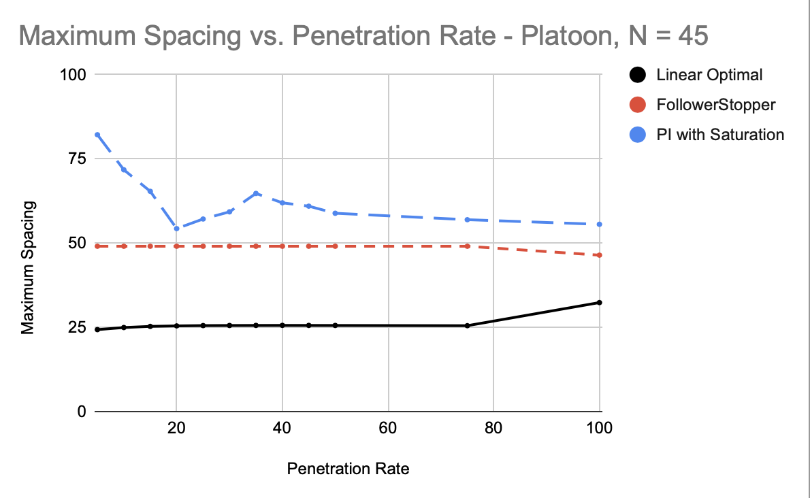
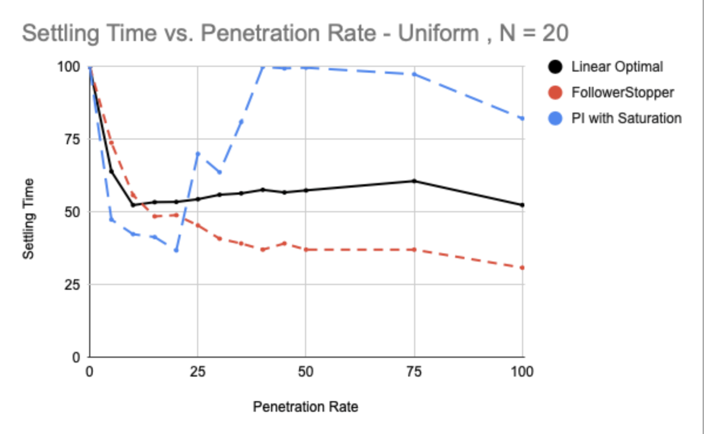
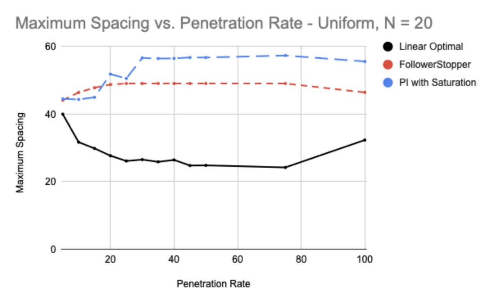
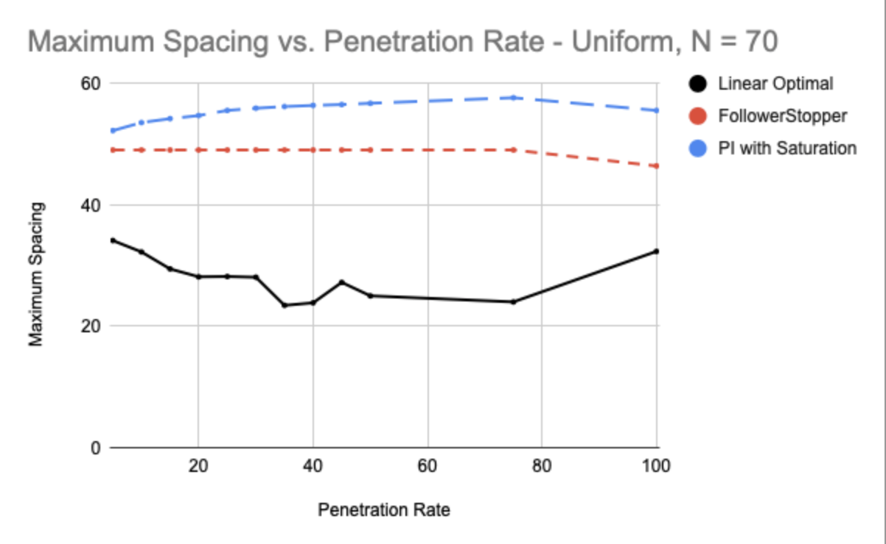
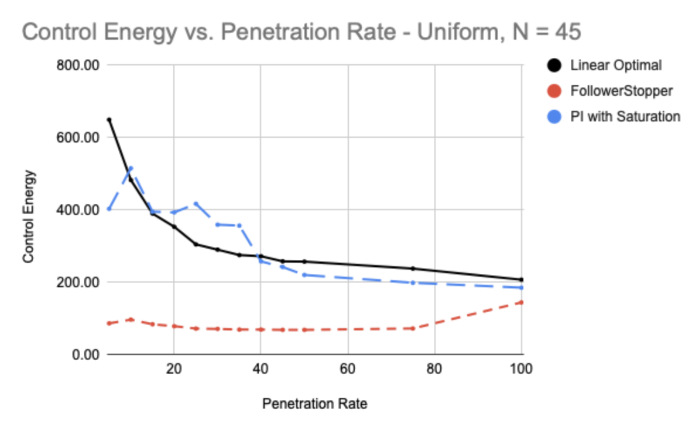
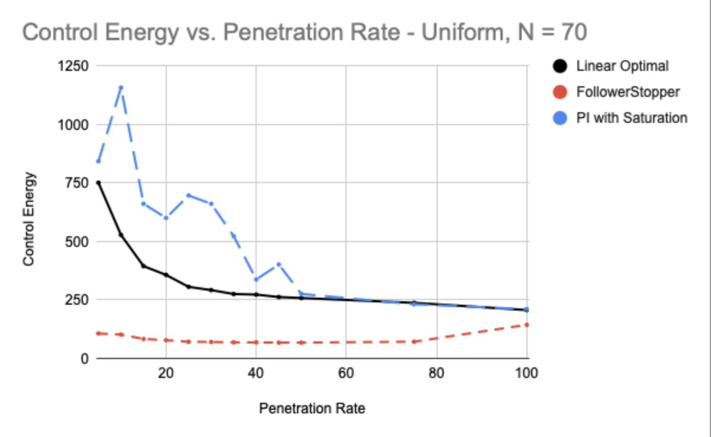

# SRIP 2022 Project: Python Simulations and Numerical Experiments

- Authors: Anish Kulkarni, Yanzhi Yao
- Advisor: Yang Zheng
- Slides: [[slides](/mixed-traffic/docs/images/penetration_rate_data/Summer Research Conference 2022.pdf)]

Here, we list some python simulations and numerical experiment results, which was led by Anish Kulkarni and Yanzhi Yao in the summer of 2022. 

## Penetration Rate
The first experiment conducted involved varying the penetration rate of AVs in a mixed traffic system of N vehicles. This variation was done in terms of a percentage value (0%, 5%, 10%, 15%, 20%, 25%, 30%, 35%, 40%, 45%, 50%, 75%, 100%) - as in, what percentage of the N vehicles were autonomous. 

## Setup
The simulation was run for T = 100 seconds for N = 20 and N = 45 vehicles ; and for T = 200 seconds for N = 70 vehicles. 

Each vehicle in the simulation was indexed from 0 to N-1. In all simulations, at T = 20 seconds, the vehicle at index '4' was slowed to a minimum speed of 8m/s. After this, the simulation was allowed to return to a stable state. In all simulations (except 100% penetration rate), the vehicle at index '4' was an HDV.

Once the system stabilized (each vehicle returned to within 3% of its original speed), the settling time, maximum spacing in front of any AV, and the control energy of each AV were calculated. These values were then graphed to identify trends in the data. 

## Modified Values
The penetration rate was varied in the system, as well as the configuration of the AVs (platoon formation / uniform distribution). 

## AV Controllers 
Three AV controllers were tested in the simulation :
 -  FollowerStopper
 -  PI with Saturation
 -  Linear Optimal Control
Each controller was tested for all penetration rates in both configurations (platoon and uniform), for all N values. 

## Experiment Result

### Platoon Case

#### Penetration Rate vs Settling Time

#### Penetration Rate vs Maximum Spacing

#### Penetration Rate vs Control Energy

### Uniform Case

#### Penetration Rate vs Settling Time

#### Penetration Rate vs Maximum Spacing

#### Penetration Rate vs Control Energy

## Raw Data

### Platoon Case

#### Linear Optimal Control

<table>
<tr><td>

|      20 vehicles     |                   |                     |                    |
|:--------------------:|-------------------|---------------------|--------------------|
| Penetration Rate (%) | Settling Time (s) | Maximum Spacing (m) | Control Energy (J) |
|           0          |        100        |          -          |          -         |
|           5          |       63.95       |        39.99        |        509.5       |
|          10          |        60.3       |        28.23        |       393.36       |
|          15          |       51.13       |        24.93        |       263.53       |
|          20          |       48.97       |        24.96        |       236.01       |   
|          25          |       48.23       |        25.18        |        232.4       |   
|          30          |       51.55       |        25.31        |        230.9       |   
|          35          |       54.23       |        25.37        |       230.17       |   
|          40          |       56.26       |        25.43        |       229.89       |   
|          45          |       58.09       |        25.49        |       229.99       |  
|          50          |       59.36       |        25.58        |       230.11       |   
|          75          |       59.35       |        25.56        |       226.92       |  
|          100         |       52.36       |        32.33        |       205.54       |   

</td><td> 

|      45 vehicles     |                   |                     |                    |   
|:--------------------:|-------------------|---------------------|--------------------|
| Penetration Rate (%) | Settling Time (s) | Maximum Spacing (m) | Control Energy (J) |   
|           0          |        100        |          -          |          -         |   
|           5          |       76.99       |        24.32        |        288.5       |   
|          10          |       75.91       |        24.94        |       233.82       |   
|          15          |       73.43       |        25.28        |       230.63       |   
|          20          |       62.86       |        25.43        |       230.36       |   
|          25          |       66.04       |        25.52        |       230.13       |   
|          30          |       69.37       |        25.55        |       229.93       |   
|          35          |       71.98       |        25.57        |       230.03       |   
|          40          |       74.05       |        25.58        |       230.11       |   
|          45          |       76.17       |        25.57        |        230.2       |   
|          50          |       76.99       |        25.56        |       230.24       |   
|          75          |       77.03       |        25.49        |       231.38       |   
|          100         |        65.7       |        32.35        |       206.49       |   

</td><td> 

|      70 vehicles     |                   |                     |                    |  
|:--------------------:|-------------------|---------------------|--------------------|
| Penetration Rate (%) | Settling Time (s) | Maximum Spacing (m) | Control Energy (J) |   
|           0          |        200        |          -          |          -         |   
|           5          |       105.3       |        24.47        |       239.71       |  
|          10          |        102        |        25.26        |       231.05       |   
|          15          |       90.07       |        25.49        |       230.11       |   
|          20          |         78        |        25.55        |       229.99       |   
|          25          |       76.47       |        25.59        |       230.19       |   
|          30          |       79.51       |         25.6        |        230.3       |   
|          35          |        82.7       |        25.61        |       230.41       |   
|          40          |       84.31       |        25.62        |       230.47       |   
|          45          |        85.6       |        25.62        |       230.51       |  
|          50          |       86.16       |        25.61        |       230.54       |  
|          75          |       84.24       |        25.44        |       230.68       |   
|          100         |       71.66       |        32.35        |       206.59       |   

</td></tr> 
</table>

#### Follow-stopper

<table>
<tr><td> 

|      20 vehicles     |                   |                     |                    |  
|:--------------------:|-------------------|---------------------|--------------------|
| Penetration Rate (%) | Settling Time (s) | Maximum Spacing (m) | Control Energy (J) |   
|           0          |        100        |          -          |          -         |   
|           5          |       73.82       |        44.12        |        44.74       |  
|          10          |       58.41       |        45.07        |        66.46       |  
|          15          |       58.08       |        46.61        |        71.42       | 
|          20          |       50.76       |        48.82        |        71.61       |  
|          25          |       36.99       |        49.07        |        71.61       |  
|          30          |       36.99       |        49.07        |        71.61       |  
|          35          |       36.99       |        49.07        |        71.61       | 
|          40          |       36.99       |        49.07        |        71.61       | 
|          45          |       36.99       |        49.07        |        71.61       | 
|          50          |       36.99       |        49.07        |        71.61       | 
|          75          |       36.99       |        49.07        |        71.61       | 
|          100         |        30.8       |        46.43        |       143.57       | 

 </td><td>

|      45 vehicles     |                   |                     |                    |   
|:--------------------:|-------------------|---------------------|--------------------|
| Penetration Rate (%) | Settling Time (s) | Maximum Spacing (m) | Control Energy (J) |   
|           0          |        100        |          -          |          -         |   
|           5          |       89.49       |        49.07        |        71.42       |  
|          10          |       36.99       |        49.07        |        71.61       |  
|          15          |       36.99       |        49.07        |        71.61       | 
|          20          |       36.99       |        49.07        |        71.61       | 
|          25          |       36.99       |        49.07        |        71.61       |  
|          30          |       36.99       |        49.07        |        71.61       |  
|          35          |       36.99       |        49.07        |        71.61       | 
|          40          |       36.99       |        49.07        |        71.61       |  
|          45          |       36.99       |        49.07        |        71.61       |  
|          50          |       36.99       |        49.07        |        71.61       |  
|          75          |       36.99       |        49.07        |        71.61       |  
|          100         |       29.45       |        46.43        |       143.57       |   

 </td><td>

|      70 vehicles     |                   |                     |                    |   
|:--------------------:|-------------------|---------------------|--------------------|
| Penetration Rate (%) | Settling Time (s) | Maximum Spacing (m) | Control Energy (J) |   
|           0          |        200        |          -          |          -         |   
|           5          |       112.46      |        49.07        |        71.61       |   
|          10          |       36.99       |        49.07        |        71.61       |   
|          15          |       36.99       |        49.07        |        71.61       |   
|          20          |       36.99       |        49.07        |        71.61       |   
|          25          |       36.99       |        49.07        |        71.61       |  
|          30          |       36.99       |        49.07        |        71.61       |   
|          35          |       36.99       |        49.07        |        71.61       |   
|          40          |       36.99       |        49.07        |        71.61       |   
|          45          |       36.99       |        49.07        |        71.61       |   
|          50          |       36.99       |        49.07        |        71.61       |   
|          75          |       36.99       |        49.07        |        71.61       |   
|          100         |       28.62       |        46.43        |       143.57       |

 </td></tr>
 </table>

#### PI with Saturation

|      20 vehicles     |                   |                     |                    |   
|:--------------------:|-------------------|---------------------|--------------------|
| Penetration Rate (%) | Settling Time (s) | Maximum Spacing (m) | Control Energy (J) |   
|           0          |        100        |          -          |          -         |   
|           5          |       47.36       |        44.51        |       100.93       |   
|          10          |       48.54       |        47.63        |       183.58       |   
|          15          |       59.77       |        48.16        |       257.51       |  
|          20          |       52.55       |        49.86        |       306.33       |   
|          25          |       56.62       |        55.97        |       339.02       |   
|          30          |       72.06       |          59         |       357.82       |   
|          35          |       92.02       |        57.45        |       359.71       |   
|          40          |       99.76       |        57.06        |       352.48       |   
|          45          |       99.53       |        57.23        |       336.76       |   
|          50          |        99.4       |        57.09        |       316.38       |   
|          75          |       99.82       |        57.46        |       237.08       |   
|          100         |        82.2       |        55.59        |        169.6       |   

|      45 vehicles     |                   |                     |                    |   
|:--------------------:|-------------------|---------------------|--------------------|
| Penetration Rate (%) | Settling Time (s) | Maximum Spacing (m) | Control Energy (J) |   
|           0          |        100        |          -          |          -         |  
|           5          |       72.75       |        82.19        |       367.15       |   
|          10          |       60.05       |        71.78        |       561.25       |   
|          15          |       62.46       |        65.38        |        696.7       |   
|          20          |       86.35       |        54.31        |       771.33       |   
|          25          |       99.21       |        57.16        |       805.42       |   
|          30          |       99.44       |        59.29        |       802.81       |   
|          35          |       99.54       |        64.75        |       941.29       |   
|          40          |       99.66       |        61.97        |       761.13       |   
|          45          |       99.85       |        60.97        |       672.15       |   
|          50          |       99.69       |        58.87        |       598.08       |   
|          75          |       99.03       |        56.96        |       383.13       |   
|          100         |        82.2       |        55.59        |       184.44       |   

|      70 vehicles     |                   |                     |                    |   
|:--------------------:|-------------------|---------------------|--------------------|
| Penetration Rate (%) | Settling Time (s) | Maximum Spacing (m) | Control Energy (J) |   
|           0          |        200        |          -          |          -         |   
|           5          |       178.53      |        76.57        |        781.3       |   
|          10          |       199.84      |        43.04        |       960.99       |   
|          15          |       199.77      |        38.52        |       910.12       |   
|          20          |       199.2       |        38.53        |       1440.18      |   
|          25          |       195.18      |        38.65        |       2160.75      |   
|          30          |       199.96      |        40.39        |       2768.83      |   
|          35          |       199.97      |        43.98        |       2389.89      |   
|          40          |       199.97      |         46.8        |       1982.72      |   
|          45          |       199.97      |        51.43        |       1468.96      |   
|          50          |       199.81      |        54.87        |       1159.32      |   
|          75          |       199.4       |        55.62        |        501.3       |  
|          100         |       107.5       |        55.59        |       210.52       |  

### Uniform Case

#### Optimal Control

|      20 vehicles     |                   |                     |                    |   
|:--------------------:|-------------------|---------------------|--------------------|
| Penetration Rate (%) | Settling Time (s) | Maximum Spacing (m) | Control Energy (J) |   
|           0          |        100        |          -          |          -         |   
|           5          |       63.95       |        39.99        |       509.51       |   
|          10          |       52.35       |        31.69        |       421.48       |  
|          15          |       53.37       |        29.84        |       366.58       |   
|          20          |       53.45       |        27.68        |       328.22       |   
|          25          |       54.37       |        26.11        |       302.28       |   
|          30          |       55.92       |        26.53        |       277.81       |   
|          35          |       56.39       |        25.86        |       264.00       |   
|          40          |       57.61       |        26.43        |       253.78       |   
|          45          |       56.72       |        24.78        |       261.42       |  
|          50          |       57.42       |        24.82        |       249.11       |   
|          75          |       60.63       |        24.21        |       234.38       |   
|          100         |       52.36       |        32.33        |       205.54       |   

|      45 vehicles     |                   |                     |                    |   
|:--------------------:|-------------------|---------------------|--------------------|
| Penetration Rate (%) | Settling Time (s) | Maximum Spacing (m) | Control Energy (J) |   
|           0          |        100        |          -          |          -         |   
|           5          |       82.56       |        34.19        |       649.32       |   
|          10          |        77.6       |          32         |       482.42       |   
|          15          |       74.63       |        28.69        |       389.49       |   
|          20          |       74.72       |        28.16        |       352.97       |   
|          25          |       73.51       |        28.01        |       304.23       |   
|          30          |       73.56       |        27.57        |       289.56       |   
|          35          |       73.83       |        27.27        |       274.73       |   
|          40          |       75.61       |        23.86        |       271.47       |  
|          45          |       75.44       |        23.81        |       257.19       |  
|          50          |       78.38       |        24.34        |       256.54       |  
|          75          |       80.36       |        24.12        |       237.20       |   
|          100         |        65.7       |        32.35        |       206.49       |   

|      70 vehicles     |                   |                     |                    |   
|:--------------------:|-------------------|---------------------|--------------------|
| Penetration Rate (%) | Settling Time (s) | Maximum Spacing (m) | Control Energy (J) |   
|           0          |        200        |          -          |          -         |   
|           5          |       107.86      |        34.14        |       751.05       |   
|          10          |       94.37       |        32.26        |       527.79       |   
|          15          |        89.2       |        29.46        |       394.53       |   
|          20          |        88.3       |        28.16        |       356.84       |   
|          25          |       84.32       |        28.21        |       305.86       |   
|          30          |       84.01       |        28.09        |         292        |   
|          35          |       83.45       |        23.45        |       275.18       |   
|          40          |       87.83       |        23.87        |        272.8       |   
|          45          |       82.77       |        27.24        |       262.37       |   
|          50          |       89.92       |        25.02        |       258.13       |   
|          75          |        94.5       |        24.02        |       237.53       |   
|          100         |       71.66       |        32.35        |       206.59       |   

#### Follow-Stopper

|      20 vehicles     |                   |                     |                    |   
|:--------------------:|-------------------|---------------------|--------------------|
| Penetration Rate (%) | Settling Time (s) | Maximum Spacing (m) | Control Energy (J) |   
|           0          |        100        |          -          |          -         |   
|           5          |       73.82       |        44.12        |        44.74       |   
|          10          |       55.79       |        46.42        |        65.01       |   
|          15          |       48.47       |        47.81        |        76.88       |   
|          20          |        48.9       |        48.76        |        77.12       |   
|          25          |       45.36       |        49.07        |        73.74       |   
|          30          |       40.79       |        49.07        |        70.22       |   
|          35          |       39.13       |        49.07        |        68.49       |   
|          40          |       37.01       |        49.07        |        67.58       |   
|          45          |       39.13       |        49.07        |        68.49       |   
|          50          |       37.01       |        49.07        |        67.58       |   
|          75          |         37        |        49.07        |        66.65       |   
|          100         |        30.8       |        46.43        |       143.57       |   

|      45 vehicles     |                   |                     |                    |   
|:--------------------:|-------------------|---------------------|--------------------|
| Penetration Rate (%) | Settling Time (s) | Maximum Spacing (m) | Control Energy (J) |   
|           0          |        100        |          -          |          -         |   
|           5          |       79.81       |        49.07        |        85.60       |   
|          10          |       69.22       |        49.07        |        95.88       |   
|          15          |       61.12       |        49.07        |        83.04       |   
|          20          |       53.27       |        49.07        |        77.81       |   
|          25          |       43.67       |        49.07        |        71.19       |   
|          30          |       40.43       |        49.07        |        70.22       |   
|          35          |       37.01       |        49.07        |        68.49       |   
|          40          |       37.01       |        49.07        |        68.49       |   
|          45          |         37        |        49.07        |        67.58       |   
|          50          |         37        |        49.07        |        67.58       |   
|          75          |       36.99       |        49.07        |        71.48       |   
|          100         |       29.45       |        46.43        |       143.57       |   

|      70 vehicles     |                   |                     |                    |   
|:--------------------:|-------------------|---------------------|--------------------|
| Penetration Rate (%) | Settling Time (s) | Maximum Spacing (m) | Control Energy (J) |   
|           0          |        200        |          -          |          -         |   
|           5          |       109.02      |        49.07        |       106.55       |   
|          10          |       81.81       |        49.07        |       102.00       |   
|          15          |        59.3       |        49.07        |        83.04       |   
|          20          |       53.27       |        49.07        |        77.81       |   
|          25          |       43.67       |        49.07        |        71.19       |   
|          30          |       38.54       |        49.07        |        70.22       |   
|          35          |         37        |        49.07        |        68.49       |   
|          40          |         37        |        49.07        |        68.49       |   
|          45          |       36.99       |        49.07        |        67.58       |   
|          50          |       36.99       |        49.07        |        67.58       |   
|          75          |       36.99       |        49.07        |        71.48       |   
|          100         |       28.62       |        46.43        |       143.57       |   

#### PI with Saturation

|      20 vehicles     |                   |                     |                    | 
|:--------------------:|-------------------|---------------------|--------------------|
| Penetration Rate (%) | Settling Time (s) | Maximum Spacing (m) | Control Energy (J) |   
|           0          |        100        |          -          |          -         |   
|           5          |       47.36       |        44.51        |       100.93       |   
|          10          |       42.33       |        44.35        |       186.88       |   
|          15          |       41.35       |        44.97        |       244.70       |   
|          20          |       36.75       |        51.83        |       214.24       |   
|          25          |         70        |        50.56        |       252.40       |   
|          30          |       63.68       |        56.64        |       246.82       |   
|          35          |       80.96       |        56.46        |       255.16       |   
|          40          |       99.97       |         56.5        |       278.93       |   
|          45          |       99.45       |        56.78        |       225.27       |   
|          50          |       99.67       |        56.77        |       217.17       |   
|          75          |       97.42       |        57.35        |       200.88       |   
|          100         |        82.2       |        55.59        |       169.60       |   

|      45 vehicles     |                   |                     |                    |   
|:--------------------:|-------------------|---------------------|--------------------|
| Penetration Rate (%) | Settling Time (s) | Maximum Spacing (m) | Control Energy (J) |   
|           0          |        100        |          -          |          -         |   
|           5          |       99.91       |        53.97        |       402.65       |   
|          10          |        83.2       |        53.75        |       514.88       |   
|          15          |       51.26       |         54.7        |       394.68       |   
|          20          |       98.21       |        54.82        |       392.74       |   
|          25          |       99.92       |        55.74        |       416.49       |   
|          30          |       99.96       |        55.83        |       358.77       |   
|          35          |       99.75       |        56.36        |       356.22       |   
|          40          |       99.65       |        56.41        |       257.17       |   
|          45          |       99.83       |        56.77        |       241.53       |   
|          50          |       99.82       |        57.22        |       219.58       |   
|          75          |       98.13       |        57.35        |       197.95       |   
|          100         |        82.2       |        55.59        |       184.44       |   

|      70 vehicles     |                   |                     |                    |  
|:--------------------:|-------------------|---------------------|--------------------|
| Penetration Rate (%) | Settling Time (s) | Maximum Spacing (m) | Control Energy (J) |   
|           0          |        200        |          -          |          -         |   
|           5          |       199.75      |        52.26        |       843.00       |   
|          10          |       199.84      |        53.59        |       1157.84      |  
|          15          |       199.83      |        54.23        |       661.12       |   
|          20          |       199.81      |        54.74        |       600.68       |   
|          25          |       199.3       |        55.59        |       696.60       |  
|          30          |       199.87      |        55.95        |       660.99       |   
|          35          |       199.89      |        56.23        |       522.50       |   
|          40          |       199.97      |        56.41        |       337.49       |   
|          45          |       199.74      |        56.56        |       401.43       |   
|          50          |       199.92      |        56.77        |       275.60       |   
|          75          |       198.25      |        57.68        |       231.40       |   
|          100         |       107.5       |        55.59        |       210.52       |   

## Result Graphs
Using all of the raw data obtained through the simulation, we were able to create several graphs detailing the results of the experiment. 

* INSERT IMAGES * 

## Analysis
From the data, we can infer several aspects of each controller and their efficacy - 
- FollowerStopper : This controller performed the best with a larger and larger simulation size. We observed lower energy consumption and a smaller settling time on average for FollowerStopper vehicles. However, the detriment came from the excessive space usage that ocurred - in a single lane, such space usage causes few problems, but in a practical situation, it is unfeasible. 
- Linear Optimal : This controller performed well, with a roughly decreasing trend for settling time and energy usage with size. As such, we can expect it to perform better with a larger penetration rate. However, experiments showed that the best settling time usually occurred at around 30% penetration. Additionally, the space usage was the smallest out of any controller, making the controller more practical. 
- PI with Saturation : This controller had the highest average velocity at the end of the trial, but lacked in all measured aspects of the traffic flow. Therefore, it seems impractical to use it in a real traffic situation.
